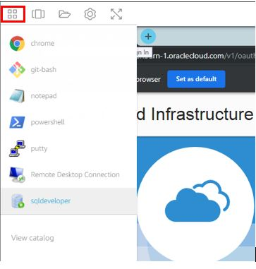

<!-- Not tested -->
# Deploying and configuring Autonomous Data Warehouse

## Introduction

Oracle Autonomous Data Warehouse Cloud provides an easy-to-use, fully autonomous database that scales elastically, delivers fast query performance and requires no database administration. In this hands on lab, we will walk through deploying an Autonomous Data Warehouse database and loading a table using a text file that is stored in object storage. The purpose of this lab is to get familiar with Oracle Autonomous Data Warehouse primitives. At the end of this lab, you will be familiar with launching an Autonomous Data Warehouse database, creating an object storage bucket and loading a table using a text file stored in object storage

### Prerequisites

* [OCI Training](https://cloud.oracle.com/en_US/iaas/training)
* [Familiarity with OCI console](https://docs.us-phoenix-1.oraclecloud.com/Content/GSG/Concepts/console.htm)
* [Overview of Networking](https://docs.us-phoenix-1.oraclecloud.com/Content/Network/Concepts/overview.htm)
* [Familiarity with Compartment](https://docs.us-phoenix-1.oraclecloud.com/Content/GSG/Concepts/concepts.htm)
* [Connecting to a compute instance](https://docs.us-phoenix-1.oraclecloud.com/Content/Compute/Tasks/accessinginstance.htm)


## **Step 1:** Sign in to OCI Console and create ADW instance

1. Sign in using your tenant name, user name and password. Use the login option under **Oracle Cloud Infrastructure**.
    


2. From the OCI Services menu, Click **Autonomous Data Warehouse** under **Database** and then **Create Autonomous Database**.
    

3. Fill out the dialog box:

      - COMPARTMENT: Choose your compartment
      - DISPLAY NAME: Provide a name
      - DATABASE NAME: Provide a name
      - Choose a Workload type: Data Warehouse
      - Choose a Deployment type: Shared Infrastructure

      Under **Configure the database**

      - Always Free: Leave Default
      - Choose database version: Leave Default
      - OCPU count: 1
      - Auto Scaling: Make sure flag is Un-checked

      Under **Create administrator credentials**

      - Username: Provide a username
      - Password: Provide a password (example Oracle123!!!!)
      - Confirm Password: Confirm the password provided

      Under **Choose network access**

      - Allow secure access from anywhere: Make sure this option is checked
      - Configure access control rules: Leave default (unchecked)

      Under **Choose a license type**

      - License Included: Check this option

4. Click **Create Autonomous Database**.

5. Click Autonomous Data Warehouse Database instance name that you created to bring up Database details page. Click **DB Connection**.

6. In the pop up window Click **Download** under **Download Client Credentials (Wallet)**. Provide a password, Click **Download** and save the zip file (Note down zip file location).

    **HINT:** You can use the same password that was used to create the instance or choose a new password. Note down the password

    

We now have a Autonomous Data Warehouse instance created. We have also downloaded the Client Credentials file. We will use this file when connecting to the database instance  using SQL Developer. Next we will create a Data file and use Object stroage to upload it to Database instance.

## **Step 2:** Create Auth token for the user connect to ADW and load data

In this section we will generate auth token for the user of this lab. An Auth token is an Oracle-generated token that you can use to authenticate with third-party APIs and Autonomous Database instance.

1. In OCI console Click the user icon (top right)  then **User settings**. Under Resources Click **Auth Token**, then **Generate Token**. In pop up window provide a description then Click **Generate Token**.

    
    

2.  Click **Copy** and save the token in Notepad.**Do not close the window without saving the token as it can not be retrieved later**.
    

3. Note down your user name.

    **Next we will connect to this ADW instance using SQL developer.**

    **Screen shots for SQL developer are from 18.1.0 version**

4. Launch SQL devleoper using Apps icon and Click **+** to create a new connection

    
    

5. Fill out the diaog box:


      - Connection Name: Provide a name
      - Username: admin
      - Password: Password used at ADW instance creation
      - Save Password: Check the flag
      - Connection Type: Cloud PDB
      - Configuration file: File that was downloaded from ADW service console (Client credentials zip file)
      - Keystore password: Password you provided when downloading the client credentials file

      **NOTE:** If using SQL developer 18.2.0 or higher this field is not available and not required


      - Service: YOUR\_ADW\_INSTANCE\_NAME\_medium
      - Click **Save**
      - Click **Connect** and verify Successful connection

    

6. Create a new user called ocitest and grant the DWROLE to ocitest user. . Also grant this user table space quota to upload the data later on. Enter commands:
    ```
    <copy>
    create user ocitest identified by P#ssw0rd12##;
    </copy>
    ```

    ```
    <copy>
    Grant dwrole to ocitest;
    </copy>
    ```

    ```
    <copy>
    Grant UNLIMITED TABLESPACE TO ocitest;
    </copy>
    ```

7. Verify the user was created

    

8. Create another connection in SQL Developer (same steps as above), use following values:


      - Connection Name: Provide a name
      - Username: OCITEST
      - Password:  P#ssw0rd12##
      - Save Password: Check the flag
      - Connection Type: Cloud PDB
      - Configuration file: File that was downloaded from ADW service console (Client credentials zip file)
      - Keystore password: Password you provided when downloading the client credentials file (NOTE: If using SQL developer 18.2.0 or higher this field is not available and not required)
      - Service: YOUR\_ADW\_INSTANCE\_NAME\_medium
      - Click **Save**
      - Click **Connect** and verify Successful connection

    

9. We will now download a text file from OCI Object storage. This file has commands that will be used to upload data into ADW and retrieve it. Open a new browser tab and copy/paste or Enter URL;

    **https://objectstorage.us-ashburn-1.oraclecloud.com/n/us_training/b/Lab-images/o/ADW-File.txt**

    **NOTE:** No spaces in URL

10. Using OCITEST user store your Object Storage credentials. From the ADW-File.txt content copy and paste the commands under  
/**** Set Definitions ****/ section. The commands will look like below

    **Begin**

    **DBMS\_CLOUD.create\_credential (**

    **credential\_name => 'OCI\_CRED\_NAME',**

    **username => 'YOUR\_USER\_NAME',**

    **password => 'AUTH\_TOKEN'**

    **) ;**

    **end;**

    **NOTE:** user name should be your user name and password should be the Auth Token generated earlier.

11. Verify **PL/SQL Procedure successfully completed** message is displayed.

    

12. Create a new table (We will load data from file in Object Storage to this table). From the ADW-File.txt content copy and paste the commands undrer /**** Create Table ****/ section. The commands will look like below

    **CREATE TABLE CHANNELS (**

    **NAME VARCHAR2(20) NOT NULL ,**

    **gender VARCHAR2(20) NOT NULL ,**

    **NAME_total NUMBER NOT NULL );**

13. Verify **Table CHANNELS created** message

    

14. Load data from file in Object Storage to newly created table.

    **NOTE:** A data file with 1000s of records exists in OCI Object storage and we will use this file records to populate ADW From the ADW-File.txt content copy and paste the commands under  /**** DBMS ****/ section. The commands will look like below

    **begin**

    **dbms\_cloud.copy\_data(**

    **table\_name =>'CHANNELS',**

    **credential\_name =>'OCI\_CRED\_NAME',**

    **file\_uri\_list =>'https://swiftobjectstorage.us-ashburn-1.oraclecloud.com/v1/us\_training/Lab-images/century\_names\_new.txt',format => json_object('delimiter' value ',', 'trimspaces' value 'lrtrim')**

    **);**

    **end;**

15. Verify **PL/SQL Procedure successfully completed** message

    

16. We will now query the table and verify the data Enter command:
    ```
    <copy>
    select * from channels;
    </copy>
    ```

    

We have successfully deployed a Autonomous Data Warehouse instance, populated a table using a file stored in Object storage and successfully run a query against the table.

## **Step 3:** Delete the resources

Delete Auth Token and Autonomous Data Warehouse

1. Navigate to User Settings ,Click **Auth Token** and Click **Delete** for your Auth Token by Hovering your mouse over action icon (Three Dots).
    

2. Navigate to Autonomous Data Warehouse menu, Hover over the action icon(Three dots) and Click **Terminate**.
    

## Acknowledgements
*Congratulations! You have successfully completed the lab.*

- **Author** - Flavio Pereira, Larry Beausoleil
- **Adapted by** -  Yaisah Granillo, Cloud Solution Engineer
- **Last Updated By/Date** - Yaisah Granillo, June 2020

