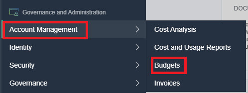
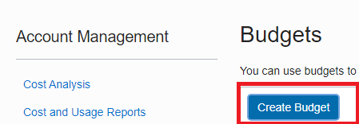
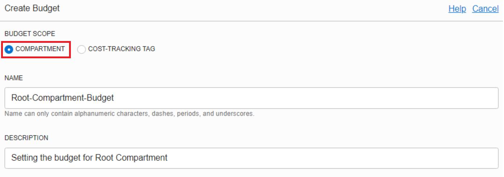
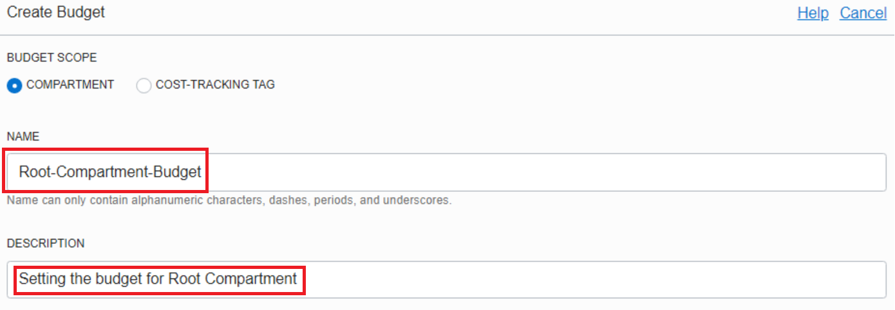
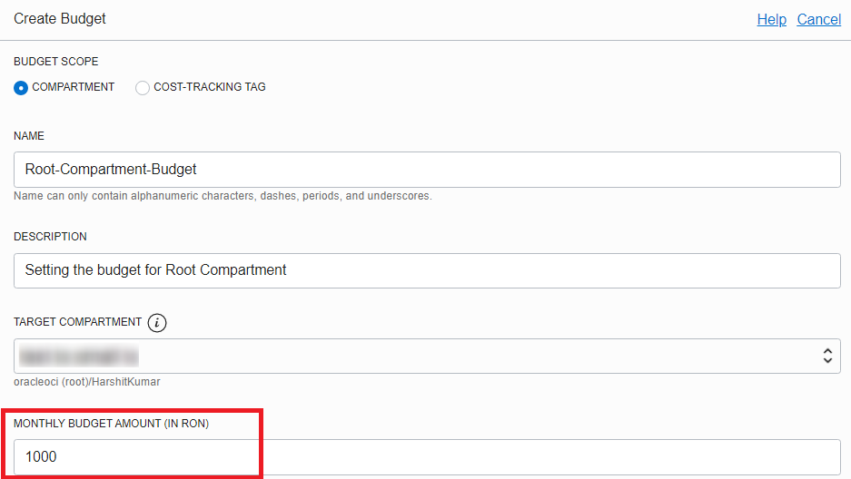
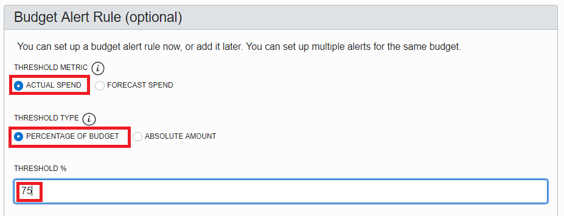
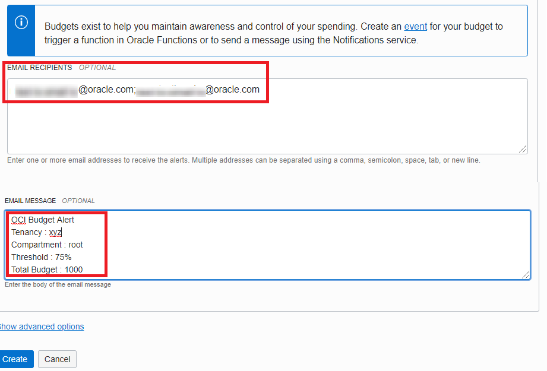
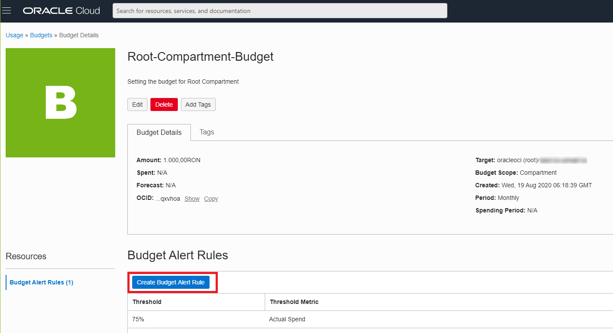

# Budget Creation

## Introduction

Budget: You can use budgets to set soft limits on your Oracle Cloud Infrastructure spending, and you can also set alerts on your budget too, to let you know when you might exceed your budget. You can view all your budgets and your current spending from a single place in OCI console. So, let’s get started

Estimated Lab Time: 30 minutes

### Prerequisites

* An Oracle Free Tier, Always Free, Paid or LiveLabs Cloud Account

## **STEP 1**: Navigate Budget
1. Open the navigation menu. Under **Governance and Administration**, go to **Account Management** and click **Budgets**.

2. All the billing and cost management related option are available under account management part of the Oracle Cloud Infrastructure console.
  

## **STEP 2**: Create budgets
1. Click **Create Budget** at the top of the budgets list. The Create Budget dialog is displayed.

  

## **STEP 3**: Select Budget Scope
1. For budgets targeting a compartment select a target compartment for your budget from the **Target Compartment** drop-down list.
2. For budgets targeting a **Cost-Tracking Tag**:
    - Select a tag namespace
    - Select a target cost-tracking tag key.
    - Enter a value for the cost-tracking tag.

3. In this workshop we have selected **Budget Scope** as Compartment.

  
  *Note: While the budget tracks spending in the specified target compartment, but you need to have permissions to manage budgets in the root compartment of the tenancy to create and use budgets.*

## **STEP 4**: Enter budget name
1. Enter a name for your budget in the **Name** text field. The name can only contain alphanumeric characters, dashes, and the underscore character, and can’t begin with a number.
2. Enter relevant  **Description** in description field.
  

## **STEP 5**: Select the Target for your budget
1. Select The compartment that you want to create the budget for, from the Target Compartment drop-down list.
2. The root compartment has been selected for this workshop, you can choose the compartment you want or have been assigned to set budget.

 

## **STEP 6**: Set monthly amount for you budget
1. Enter a monthly amount for your budget in the **Monthly Budget Amount** field. The minimum allowed value for your monthly budget is   1; the maximum allowed value is 999,999,999,999.
  

## **STEP 7**: Configure your alert rule
1. Alerts are optional but that’s a feature lets you specify the threshold on which you want an alert to be created and triggered a mail with a customized email body.

2. Alerts are evaluated in every 15 minutes and can be triggered under two conditions the first is when actual spend in OCI hits that threshold and secondly when your forecasted spent hit that threshold.

3. Select a threshold for your alert from the **Threshold Metric** drop-down list. There are two possible values:

   **Actual Spend** will watch the actual amount you spend in your compartment per month, In this workshop we have selected Actual spend.

   **Forecast Spend** will watch your resource usage and alert you when it appears that you'll exceed your budget. The forecast algorithm is linear extrapolation and requires at least 3 days of consumption to trigger.

4. The Label of the next text field changes depending on what type of threshold you selected. Enter either a **Threshold %** or a **Threshold Amount**. In this workshop we have selected Percentage of Budget, but you can select Actual spend also.

  

## **STEP 8**: Email Recipients and Message
1. In the **Email Recipients** field, enter one or more email addresses to receive the alerts. Multiple addresses can be separated using a comma, semicolon, space, tab, or new line.
2. Enter the body of your email alert in the **Email Message** field. The text of the email message cannot exceed 1000 characters.
  
Click the Create button to create your budget and alert.

## **STEP 9**: To view or edit a budget alert rule
1. After creation of budget you can see your newly created budget in the Budgets dashboard.
2. In the list of budget alert rules, click the menu icon at the right side of the list and select View/Edit from the context menu.
3. Edit your alert rule.
4. Confirm your changes by clicking Save Changes, or dismiss the dialog without saving by clicking the Cancel button.

  

You can Create additional Alert Rule by clicking **Create Budget Alert Rule**
  

## **STEP 10**: To delete a budget alert rule
1. In the list of budget alert rules, click the menu icon at the right side of the list and select Delete from the context menu.
2. Confirm the delete operation in the Confirm Delete dialog by clicking Confirm button.
  

You may now *proceed to the next lab*.

## Learn More

* [Oracle Cloud Budget](https://docs.cloud.oracle.com/en-us/iaas/Content/Billing/Concepts/budgetsoverview.htm)

## Acknowledgements
* **Authors/Contributors** - Harshit Kumar, Constantin Sebe, EMEA Hub Sales
* **Last Updated By/Date** - Harshit Kumar, September 2020
