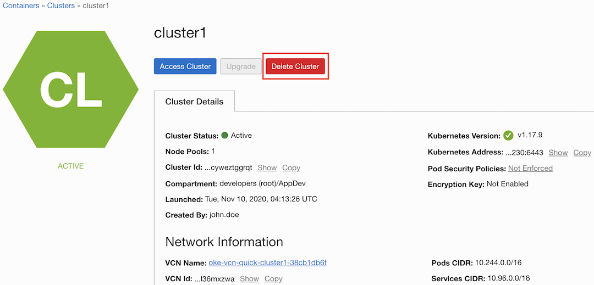
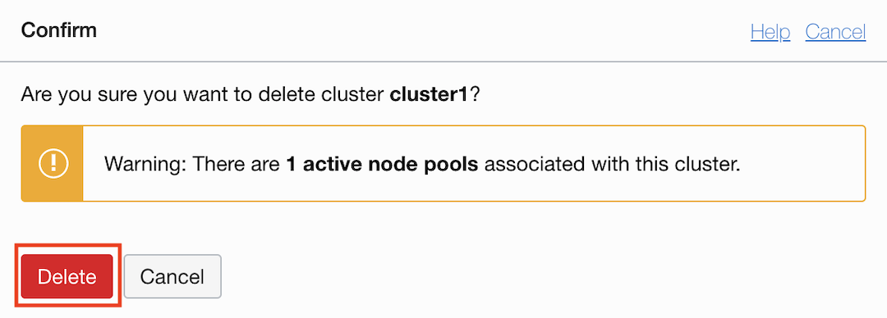

# Clean Up

## Introduction

The following steps represents cleanup operations, which may vary depending on the actions performed for setup and deployment of MuShop.

Estimated time: 10 minutes

### Objectives

- Log into OCI Tenancy.
- Undeploy the MuShop App using helm delete
- Terminate Oracle Cloud Infrastructure (OCI) components.

### Prerequisites

- Your Oracle Cloud Trial Account

## **STEP 1**: List any helm releases that may have been installed

1. To get a better look at all the installed Helm Charts by using the **helm list** command.

    ````shell
    <copy>
    helm list --all-namespaces
    </copy>
    ````

    Sample response:

    ````shell
    NAME                    NAMESPACE               REVISION        UPDATED                                 STATUS          CHART                           APP VERSION
    mushop                  mushop                  1               2020-01-31 21:14:48.511917 -0600 CST    deployed        mushop-0.1.0                    1.0
    oci-broker              mushop-utilities        1               2020-01-31 20:46:30.565257 -0600 CST    deployed        oci-service-broker-1.3.3
    mushop-utils            mushop-utilities        1               2020-01-31 20:32:05.864769 -0600 CST    deployed        mushop-setup-0.0.1              1.0
    ````

## **STEP 2**: Clean Up MuShop App

1. Remove the application from Kubernetes where --name mushop was used during install.

    ````shell
    <copy>
    helm delete mushop --namespace mushop
    </copy>
    ````

## **STEP 3**: Clean Up MuShop cluster dependencies

1. Remove the application from Kubernetes where --name mushop-utils was used during install.

    ````shell
    <copy>
    helm delete mushop-utils -n mushop-utilities
    </copy>
    ````

*Note:* When you execute the command `helm delete` for the mushop-utils chart release, the OCI LoadBalancer attached to the ingress kubernetes will also be terminated.

## **STEP 4**: Terminate the OKE Cluster and Worker Nodes

1. Delete the OKE Cluster



1. Confirm



This action will delete the Kubernetes Cluster and the Node Pool, terminating the worker nodes Compute Instances

## **STEP 5**: Remove Functions and Applications

1. *Functions and Applications:* Navigate to **Developer Services -> Functions -> Applications** and delete the desired Application

1. *Containers:* Navigate to **Developer Services -> Container Registry** and delete the container image used on the functions lab

## Acknowledgements

- **Author** - Adao Junior
- **Contributors** -  Adao Junior
- **Last Updated By/Date** - Adao Junior, October 2020
