# Use autoscale to adjust compute resources

## Introduction

In this tutorial, you'll build a load-balanced web application that can automatically scale out/in based on CPU utilization.  

In this tutorial, you'll create a load balancer, compute instance, instance configuration, and then configure auto-scaling. You'll then verify auto-scaling feature as a configured threshold on CPU is crossed.

Autoscaling enables you to automatically adjust the number of compute instances in an instance pool based on performance metrics, such as CPU utilization. This helps you provide consistent performance for your end-users during periods of high demand, and helps you reduce your costs during periods of low demand.

You select a performance metric to monitor and set thresholds that the performance metric must reach to trigger an autoscaling event. When system usage meets a threshold, autoscaling dynamically allocates resources in near-real time. As load increases, instances are automatically provisioned: the instance pool scales out. As load decreases, instances are automatically removed: the instance pool scales in.

Autoscaling relies on performance metrics that are collected by the Monitoring service. These performance metrics are aggregated into one-minute time periods and then averaged across the instance pool. When three consecutive values (that is, the average metrics for three consecutive minutes) meet the threshold, an autoscaling event is triggered.

A cooldown period between autoscaling events lets the system stabilize at the updated level. The cooldown period starts when the instance pool reaches a steady state. Autoscaling continues to evaluate performance metrics during the cooldown period. When the cooldown period ends, autoscaling adjusts the instance pool's size again if needed.

**Note**: Oracle Cloud Infrastructure (OCI) user interface is being updated, thus some screenshots in the instructions may be different than the actual UI

## Create your VCN and Subnets

Set up a VCN to connect your Linux instance to the internet. You will configure all the components needed to create your virtual network.

1. Open the navigation menu. Under Core Infrastructure, go to Networking and click **Virtual Cloud Networks**.

    Ensure that a compartment (or the compartment designated for you) is selected in the Compartment list on the left.

2. Click **Start VCN Wizard**.

3. Select VCN with Internet Connectivity, and then click **Start VCN Wizard**.

4. Enter the following (descriptions are italicized. replace with the values for your scenario):

	* Name: *Enter a name for your cloud network*
	* COMPARTMENT: *select the desired compartment*
	* VCN CIDR BLOCK: *10.0.0.0/16*
	* PUBLIC SUBNET CIDR BLOCK: *10.0.0.0/24*
	* PRIVATE SUBNET CIDR BLOCK: *10.0.1.0/24*
	* DNS RESOLUTION: *checked*

   **Note**: The public and private subnets have different CIDR blocks.

4. Click Next. 

    The Create a VCN with Internet Connection configuration dialog will be displayed, confirming all the values you just entered and listing additional components that will be created.

5. Click **Create** to start the workflow.

This will create a VCN with the following components:

    *VCN, Public subnet, Private subnet, Internet gateway (IG), NAT gateway (NAT), Service gateway (SG)*


6. After the workflow completes, click on **View Virtual Cloud Networks** and you will be directed to the details page of the VCN you created.

## Create Load Balancer and Update Security List

1. Open the navigation menu. Under Core Infrastructure, go to Networking and click **Load Balancers**.

2. Click **Create Load Balancer**. Fill out the dialog box;

    **Under Add Details**

    - **LOAD BALANCER NAME**: Enter a name for your load balancer.
    - **CHOOSE VISIBILITY TYPE**: Public
    - **CHOOSE THE MAXIMUM TOTAL BANDWIDTH**: Select **Dynamic Shapes** and then clikc on Micro - 10Mbps. (This specifies the bandwidth of the load balancer.)
    
    - **VIRTUAL CLOUD NETWORK**: Choose your Virtual Cloud Network
    - **SUBNET**: Choose the **Public Subnet**

    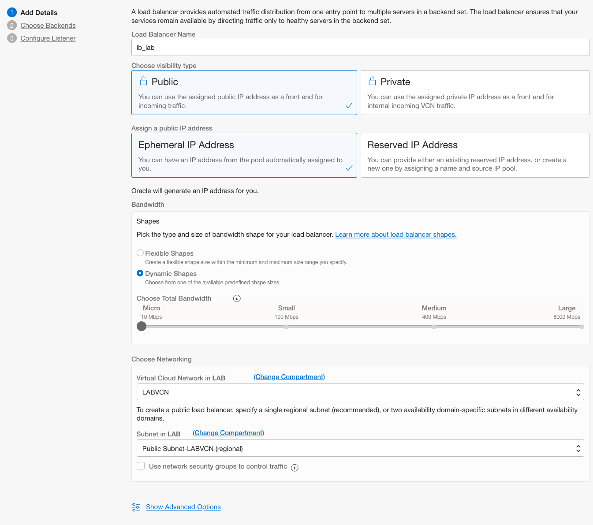

    Click **Next**.

    **Under Choose Backends:**

    - **SPECIFY A LOAD BALANCING POLICY**: Weighted Round Robin
    - **Add Backends**: Don't add any backend. This will be managed by the instance pool.

    **Under SPECIFY HEALTH CHECK POLICY**

    - **PROTOCOL**: HTTP
    - **Port**: 80
    - **URL PATH (URI)**: /

        *Leave other options as default*

    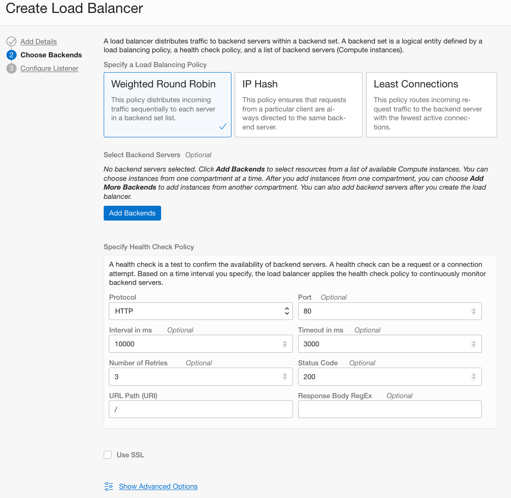

        Click **Next**.

    **Under Configure Listener**

    - **SPECIFY THE TYPE OF TRAFFIC YOUR LISTENER HANDLES**: HTTP
    - **SPECIFY THE PORT YOUR LISTENER MONITORS FOR INGRESS TRAFFIC**: 80

        *Leave other options as default*

    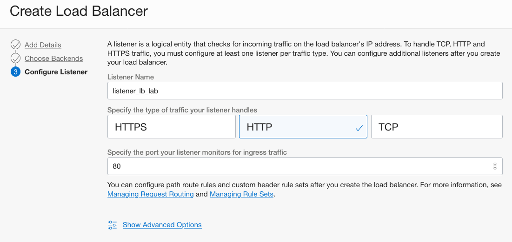

3. Click **Submit** .

4. Wait for the load balancer to become active and then note down it’s public IP address.

5. Open the navigation menu. Under Core Infrastructure, go to Networking and click **Virtual Cloud Networks** . Locate the VCN you created earlier.

6. Click VCN name to display VCN Details page.

7. Click **Security Lists**, and locate the Default Security List.

8. Click **Default Security List for Your\_VCN**, click **Add Ingress Rules**.

9. Click Add Ingress Rules.

    An **Add Ingress Rules** dialog is displayed.

10. Enter the following:

      - Ensure to leave STATELESS flag un-checked
      - Source Type: CIDR
      - Source CIDR: Enter 0.0.0.0/0
      - IP Protocol: Select TCP
      - Source Port Range: All
      - Destination Port Range: Enter 80 (the listener port)
      - Description: Allow incoming HTTP connections 

    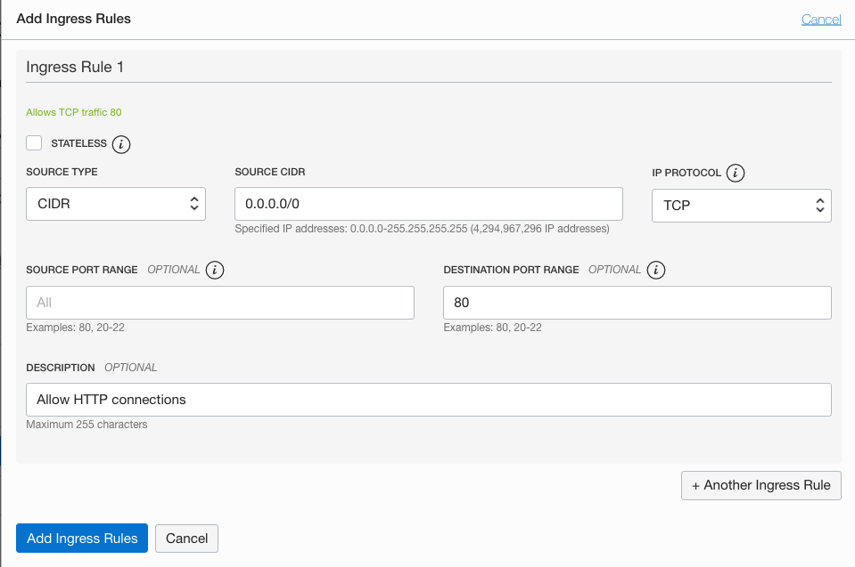

11. Click **Add Ingress Rules**.


## Create Instance Pool and Configure Autoscaling 

### Create Web Server and Configure an Instance 
Create Oracle Linux instance with Apache web server and configure an instance based on webserver. This will be the foundation for the autoscaling configuration.

1. Open the Oracle Cloud Infrastructure main menu.

2. Select **Compute** then **Instances**.

3. From the list of instances screen click **Create Instance**.

4. Enter a name for the instance.

5. Select the compartment to create the instance in.

6. In the Configure placement and hardware section, make the following selections:

    - Availability domain Select the Availability domain that you want to create the instance in
    - Fault Domain Optional. Can be left unchecked
    - Image Latest Oracle Linux ( by default the latest supported version will be already selected)
    - Shape Select the desired shape

7. In the **Configure networking** section, make the following selections:

    - Network Select an existing virtual cloud network
    - Virtual cloud network in Choose the compartent that has the desired VCN
    - Network Select the Virtual Network Cloud Network
    - Subnet in Choose the compartent that has the desired VCN
    - Subnet Select a public subnet
    - Use network security groups to control traffic unchecked
    - Public IP Address |  *Assign a public IPv4 address
    
8. In the **Add SSH keys** section:

    If you don't have an SSH key pair: 
    1. Select **Generate SSH key pair**.
    2. Click on **Save Private Key** and follow the browser propmpt to save the private key.
    3. Click on **Save Public Key** and follow the browser propmpt to save the public key.

    If you have a public key, you can:
    
    1. Select **Choose public key files**
    2. Drag and drop the public key files over or **Or browse to a location.**, find the location and select the files.

    or

    1. Select **Paste public keys**.
    2. Paste the Public Key Value into **SSH keys** (multiple keys can be added by clicking on **Anotehr key**).


9. In the **Configure boot volume**, leave all options unchecked.

10. Click  **Show Advanced Options**.

    ***Under Management***

    - **Initialization Script**: Choose **Paste cloud-init script** and paste the below script. Cloud-init script will be executed at the first boot only to configure the instance.

    ```
    #cloud-config
    yum_repos:
        epel-testing:
            baseurl: https://yum.oracle.com/repo/OracleLinux/OL7/developer_EPEL/$basearch/
            enabled: true
            failovermethod: priority
            gpgcheck: true
            gpgkey: file:///etc/pki/rpm-gpg/RPM-GPG-KEY-oracle
            name: EPEL ($basearch)

    packages:
    - httpd
    - stress

    runcmd:
    - [sh, -c, echo "<html>Web Server IP `hostname --ip-address`</html>" > /var/www/html/index.html]
    - [firewall-offline-cmd, --add-port=80/tcp]
    - [systemctl, start, httpd]
    - [systemctl, restart, firewalld]
    ```

11. Click **Create**.

12. You will be taken to the instance's details page. Once the yellow square turns green, your instance will be provisioned, up and running.

13. Wait for Instance to be in **Running** state. You can scroll down to *Work Requests* to check the process of provisioning.

14. Click Instance name. Click **More Actions**, then select **Create Instance Configuration**. Enter the following:

    - **Create in Compartment**: Choose your compartment.
    - **Name**: Provide a name.

15. Click **Create Instance Pool** and enter the following:

    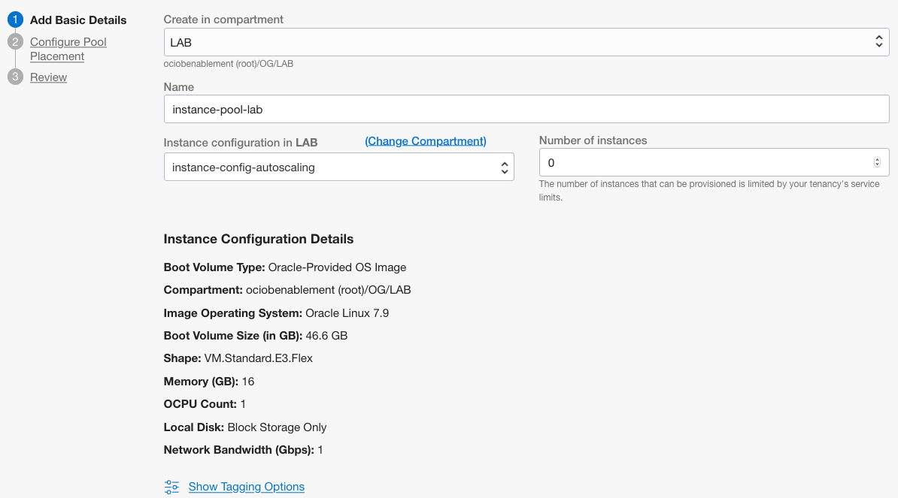

    - **Create in Compartment**: Choose your compartment
    - **Name**: Provide a name.
    - **Instance configuration in COMPARTMENT_NAME**: Choose your compartment if diferent from the current selected compartment
    - **Instance Configuration Name**: it should come already populated with the Instance Pool created on step 14.
    - **Number of Instances**: 0

    

16. **Click Next** to adavance to Configure Poll Placement

17. On the Configure Pool Placement page, enter the following:

    - **Availability domain**: Choose the AD where you want to place instances (you can choose the AD 1 if in Multi AD region).
    - **Select virtual cloud network compartment**: Choose VCN's compartment if diferent from the current selected compartment then choose your VCN.
    - **subnet in COMPARTMENT_NAME**: Choose subnet's compartment if diferent from the current selected compartment then choose your subnet.
    - **attach a load balancer**: Select this option.
    - **Load Balancer in COMPARTMENT_NAME**: Choose LB's compartment if diferent from the current selected compartment then choose your Load Balancer
    - **Backend set**: Choose the first backend set
    - **Port**: 80
    - **VNIC**: Leave the default

18. Click **Next**, revieww the information and click **Create**. 

19. Open the navigation menu. Under Core Infrastructure, select **Instace Pools** and click on the Instance Pool name.

20. In the Instance Pool details screen, click **More Actions**, select **Create Autoscaling Configuration** and enter the following:

    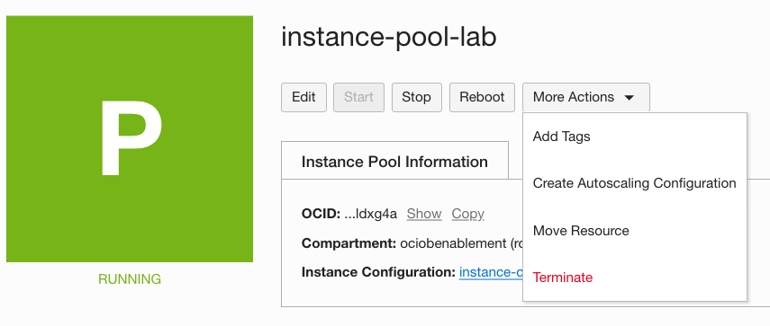

    - **Name**: Define a name
    - **Create in Compartment**: Choose your compartment
    - **Instance pool in COMPARTMENT_NAME**: Choose your compartment if diferent from the current selected compartment and then select the Instance Pool (if the pool is not visible, refresh the browser and try again)

    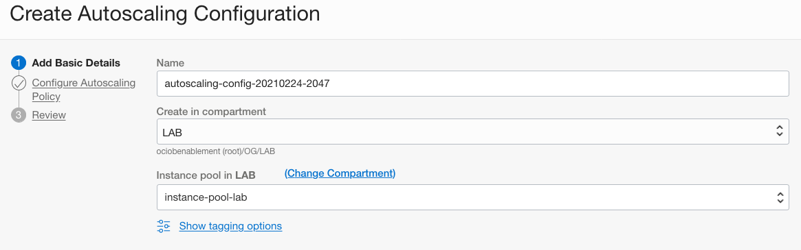

21. Click **Next** and on the Configure Autoscaling Policy page, enter the following:

    - Select **Metric-based Autoscaling**.
    - **AUTOSCALING POLICY NAME** : Provide a name
    - **COOLDOWN IN SECONDS** : 300 (This is he minimum period of time between scaling actions.)
    - **PERFORMANCE METRIC** : CPU utilization (This is the Metric to use for triggering scaling actions.)
    - **SCALE-OUT OPERATOR** : Greater than (>)
    - **THRESHOLD PERCENTAGE** : 80
    - **NUMBER OF INSTANCES TO ADD** : 1
    - **SCALE-IN OPERATOR** : Less than (<)
    - **THRESHOLD PERCENTAGE** : 20
    - **NUMBER OF INSTANCES TO REMOVE**  : 1
    - **MINIMUM NUMBER OF INSTANCES** : 1 (this is the minimum number of instances that the pool will always have)
    - **MAXIMUM NUMBER OF INSTANCES** : 2 (this is the maximum number of instances that the pool will always have)
    - **INITIAL NUMBER OF INSTANCES** : 1 (this is how many instances will be created in the instance pool initially)

    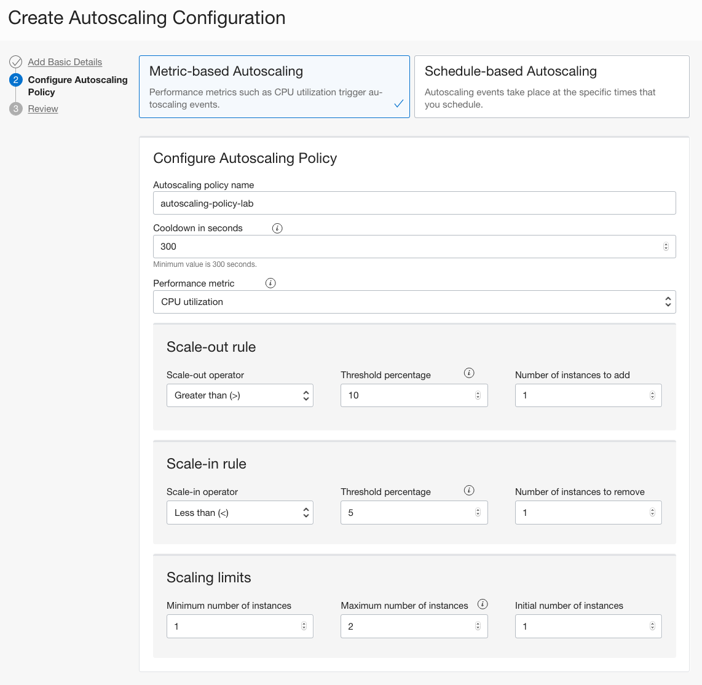

22. Click **Next**, revieww the information and click **Create**.

## Test the setup

1. In the load balancer details, look at the Public IP of the Load Balancer and open in the web browser.

2. Back in the OCI console, Under **Compute**, click **Instance Pools**, and then your pool name. Click **Created Instances**, you should see a compute instance created. Click the Compute Instance name.


3. In the terminal where you saved yout priate key, ssh to the instance 

    ```
    ssh -i <private_key> opc@<PUBLIC_IP_OF_COMPUTE>
    ```

4. Now start CPU stress, Enter command:

    ```
    sudo stress --cpu 4 --timeout 350
    ```

    *Spawn 4 workers spinning with a timeout of 350 seconds.*

5. Switch back to OCI console and navigate to Instance Pool Details page. Scroll down to **Metric** screen, you should see CPU spiking up after a minute or so.
    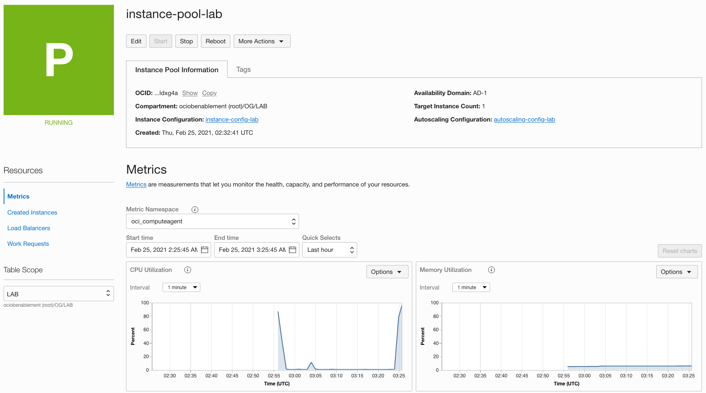

6. In about 3-5 minutes (time configured when we created auto scale configuration), status of Pool should change to **Scaling** and a second compute instance should launch. Click on **Work Requests and you will see the work request that will create a new instance.
    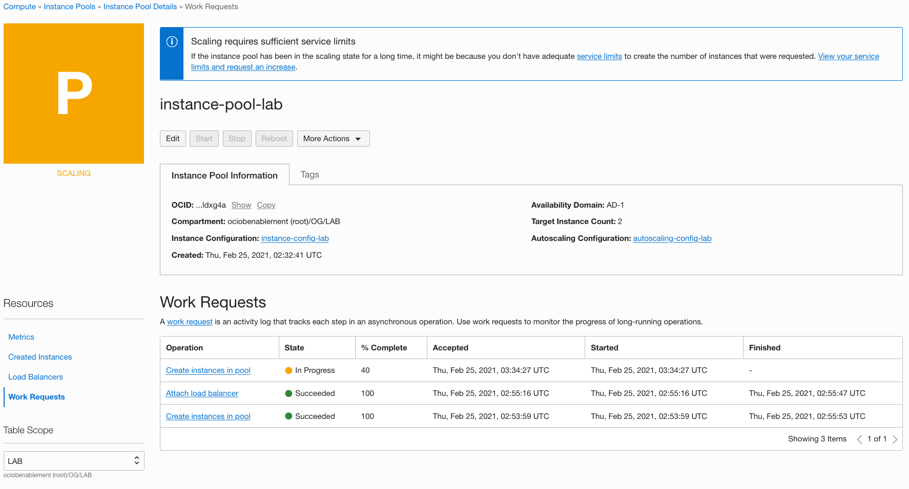

    *This is since our criteria of CPU utilization > 10 was met.*

7. When the second instance is up and running and the instance pool status is 'Running', switch to the web browser and refresh the page multiple times and observe the load balancer balancing traffic between the two web servers.

8. Switch back to the terminal and if the stress tool is still running, click Ctrl + C to stop the script.

9. Switch back to OCI console window and navigate to your compute instance details page. Verify CPU utilization goes down after a minute.
    
10. Navigate to Instance pool details page and after 3-4 minute Instance pool status will change to **Scaling** . Additional compute instance will be deleted.
    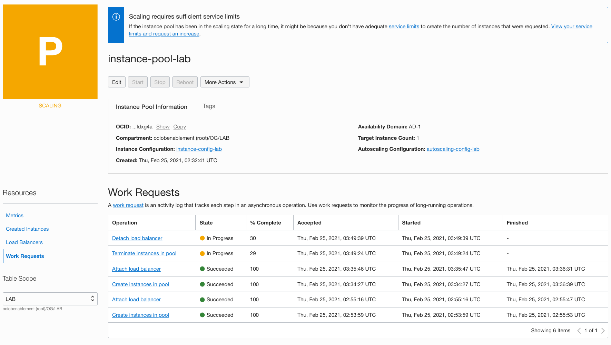

    *This is because our criteria of CPU utilization < 5 is met.*

## Delete Resources

1. Switch to  OCI console window.

2. Open the navigation menu. Under Core Infrastructure, select **Instaces Pools**. At the far right, click in the three dots  and select **Terminate**. Confirm when prompted.

3. Open the navigation menu. Under Core Infrastructure, select **AutoScaling Configurations**. At the far right, click in the three dots  and select **Terminate**. Confirm when prompted.

4. Open the navigation menu. Under Core Infrastructure, select **Instaces Configurations**. At the far right, click in the three dots  and select **Terminate**

5. Open the navigation menu. Under Core Infrastructure, select **Instaces**. At the far right, click in the three dots  and select **Terminate**. Cehck the box **Permanently delete the attached boot volume** and click on **Terminate Instance**.

6. Open the navigation menu. Under Networking, select **Load Balancers**. At the far right, click in the three dots  and select **Terminate**. Confirm when prompted.

7. Open the navigation menu. Under Networking, select **Virtual Cloud Networks**. At the far right, click in the three dots  and select **Terminate**. Confirm when prompted.

*Congratulations! You have successfully completed the lab.*

## Acknowledgements

- **Author** - Flavio Pereira, Larry Beausoleil
- **Adapted by** -  Yaisah Granillo, Cloud Solution Engineer
- **Last Updated By/Date** - Orlando Gentil, March 2021

