# Identity and Access Management

## Introduction

Oracle Cloud Infrastructure Identity and Access Management (IAM) Service lets you control who has access to your cloud resources. You control the types of access a group of users has and to which specific resources. The purpose of this lab is to give you an overview of the IAM Service components and an example scenario to help you understand how they work together.

Estimated time: 30 minutes

There is a recording of the instructor going through this lab here:

[](youtube:wQU9mb9yX7o)

### Prerequisites

- Oracle Cloud Infrastructure account credentials (User, Password, and Tenant)
- To sign in to the Console, you need the following:
  - Tenant, User name and Password
 
## **STEP 1**: Creating Compartments

A compartment is a collection of cloud assets, like compute instances, load balancers, databases, etc. By default, a root compartment was created for you when you created your tenancy (ie when you registered for the trial account). It is possible to create everything in the root compartment, but Oracle recommends that you create sub-compartments to help manage your resources more efficiently.

1. From the menu, select **Identity** and **Compartments**. Click on the blue **Create Compartment** button to create a sub-compartment.

   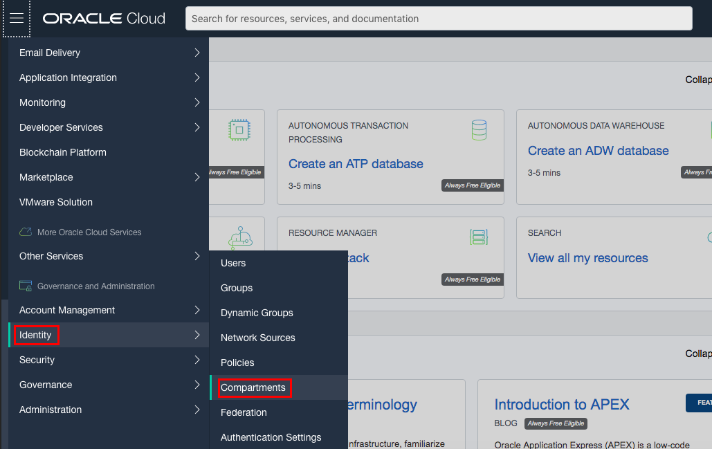
   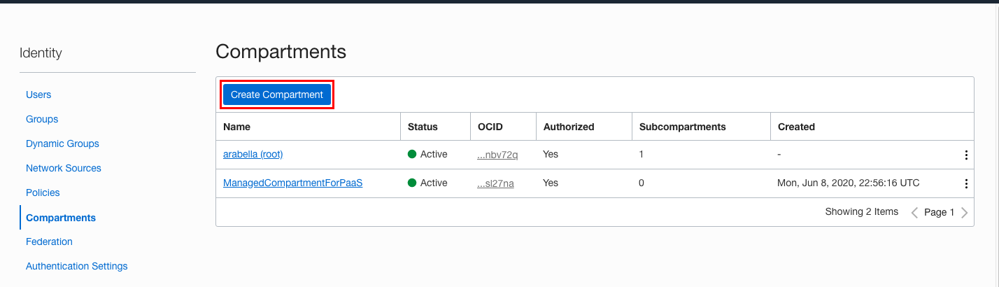

2. Name the compartment **Demo** and provide a short description. Be sure your root compartment is shown as the parent compartment. Press the blue **Create Compartment** button when ready.

   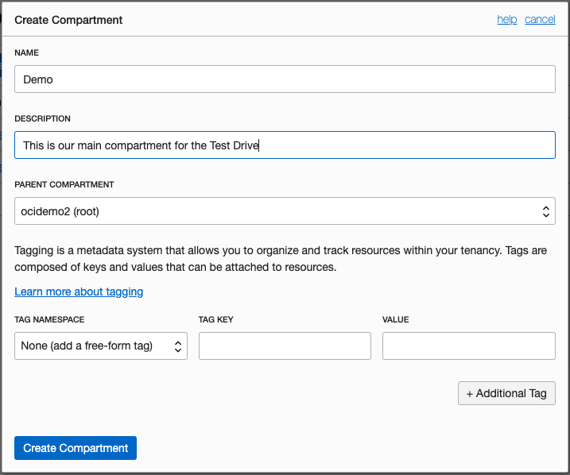

3. You have just created a compartment for all of your work in this Test Drive.

## **STEP 2**: Managing Users, Groups and Policies to Control Access

A user's permissions to access services comes from the _groups_ to which they belong. The permissions for a group are defined by policies. Policies define what actions members of a group can perform, and in which compartments. Users can access services and perform operations based on the policies set for the groups of which they are members.

We'll create a user, a group, and a security policy to understand the concept.

1. Sign in to the console, on the **Menu** click **Identity**, then select **Groups**.
   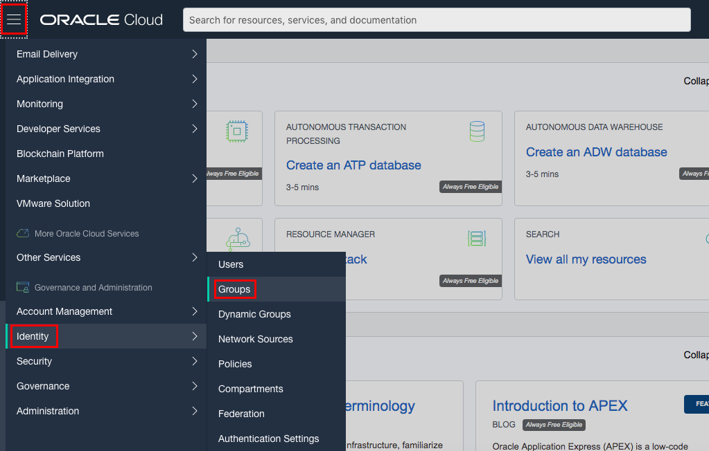

2. Click **Create Group**.
   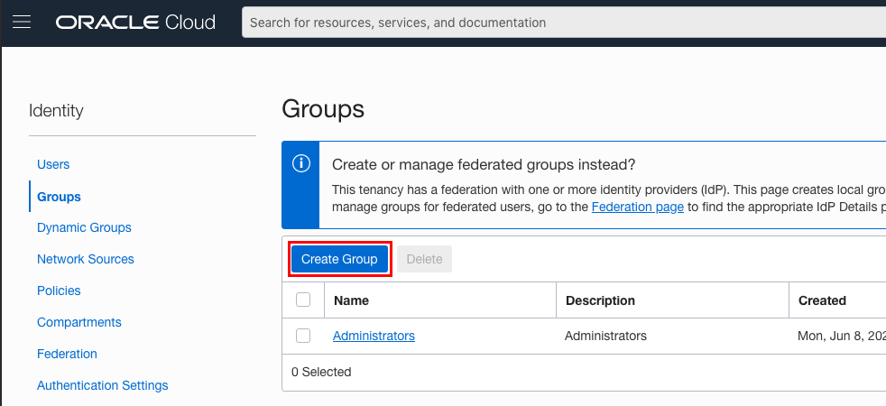

3. In the **Create Group** dialog box, enter the following:

     - **Name:** Enter a unique name for your group such as "oci-group” Note that the group name cannot contain spaces.
     - **Description:** Enter a description (for example, “New group for oci users”).
     - Click **Create**.

   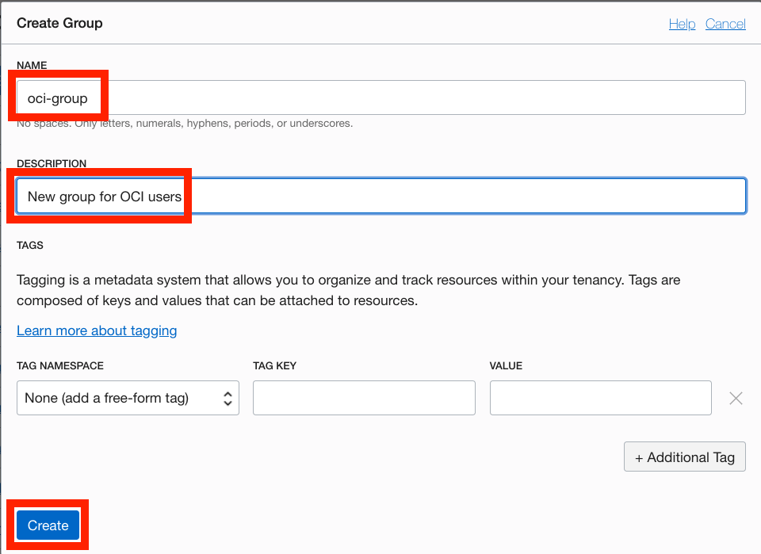

4. Click on your new group to display it. Your new group is displayed.

   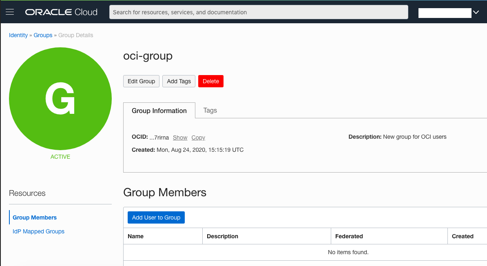

5. Now, let’s create a security policy that gives your group permissions in your assigned compartment. For example, create a policy that gives permission to compartment **Demo** to members or group oci-group:

   a) On the **Menu** click **Identity**, and then click **Policies**.

   b) On the left side, select **Demo** compartment.
   

   NOTE: You may need to click on the + sign next to your main compartment name to be able to see the sub-compartment ***Demo***. If you do, and you still don't see the sub-compartment, ***Refresh your browser***. Sometimes your browser caches the compartment information and does not update its internal cache.

   c) After you have selected the **Demo** compartment, click **Create Policy**.
      

   d) Enter a unique **Name** for your policy (For example, "Policy-for-oci-group") **Note that the name can NOT contain spaces.**

   e) Enter a **Description** (for example, "Policy for OCI Group").
   
   f) Click **Customize(Advanced)** link and enter the following **Statement**:
     ```
     <copy>Allow group oci-group to manage all-resources in compartment Demo</copy>
     ```

   g) Click **Create**.

   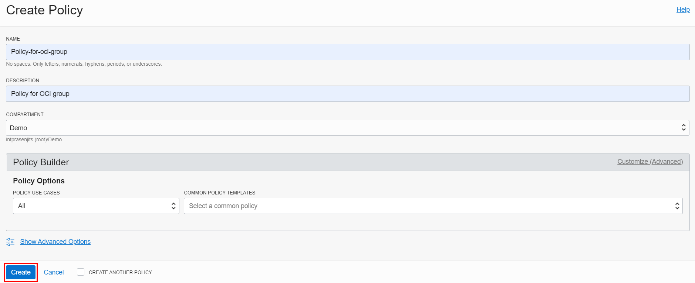

6. Create a New User

   a) On the **Menu** click **Identity**, and then click **Users**.
      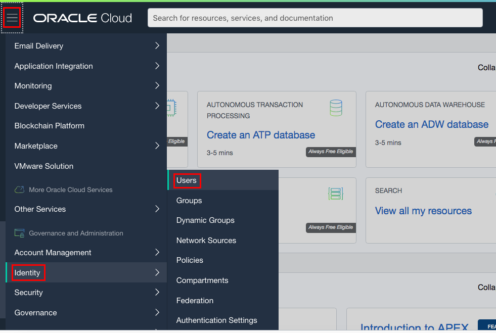

   b) Click **Create User**.

   c) In the **New User** dialog box, enter the following:

      - **Name:** Enter a unique name or email address for the new user.
      _This value is the user's login name for the Console and it must be unique across all other users in your tenancy._
      - **Description:** Enter a description. For example, New `oci user`.
      - **Email:**  Preferably use a personal email address to which you have access (GMail, Yahoo, etc).

      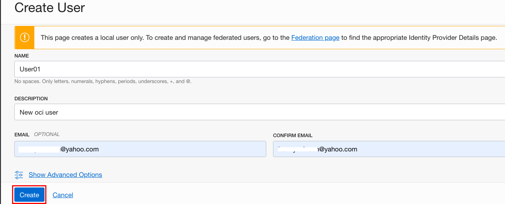

   d) Click **Create**.

7. Set a Temporary Password for the newly created User

   a) From the list of users, click on **the user that you created** to display its details.

   b) Click **Create/Reset Password**.  

      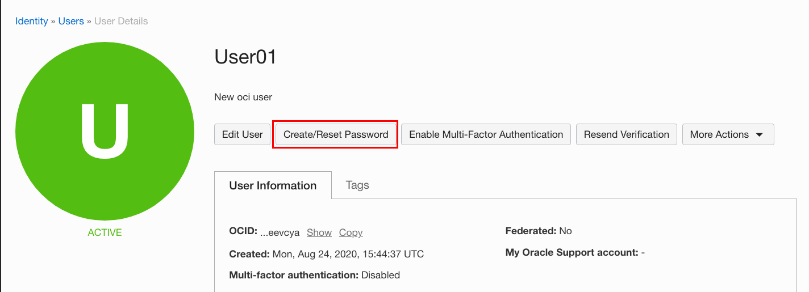

   c) In the dialog, click **Create/Reset Password**.

      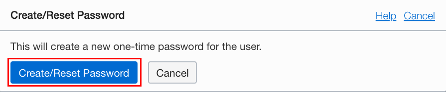

   d) The new one-time password is displayed.

      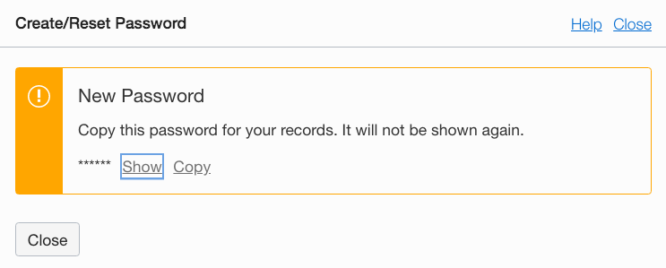

   e) Click the **Copy** link and then click **Close**. Make sure to copy this password to your notepad.

   f) Click **Sign Out** from the user menu and log out of the admin user account completely.

      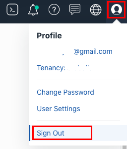

8. Sign in as the new user using a different web browser or an incognito window.

    a) Open a supported browser and go to the Console URL:  [https://cloud.oracle.com](https://cloud.oracle.com).

    b) Click on the portrait icon in the top-right section of the browser window, then click on the **Sign in to Cloud** link.

    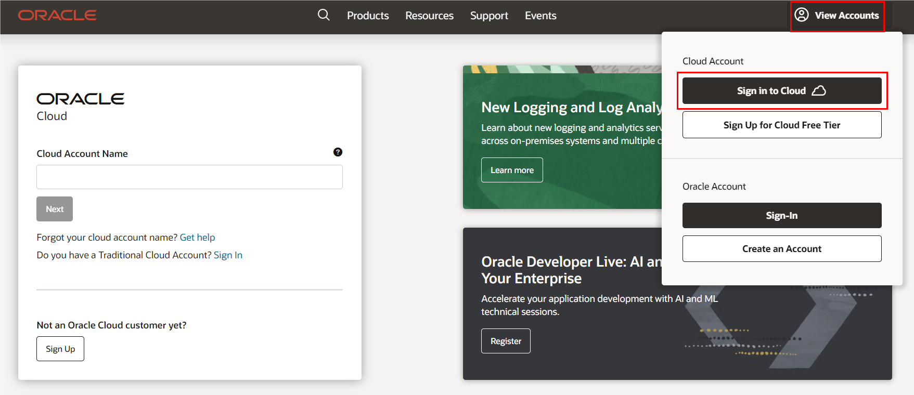

   c) Enter the name of your tenancy (aka your account name, not your user name), then click on the **Next** button.

   

   d) This time, you will sign in using **local credentials box** with the user you created. Note that the user you created is not part of the Identity Cloud Services.

   e) Enter the password that you copied.

      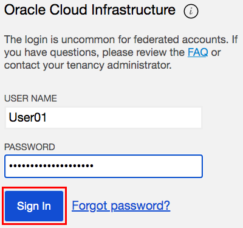

   **Note:** _Since this is the first-time sign-in, the user will be prompted to change the temporary password, as shown in the screen capture._

   f) Set the new password. Click **Save New Password**.
      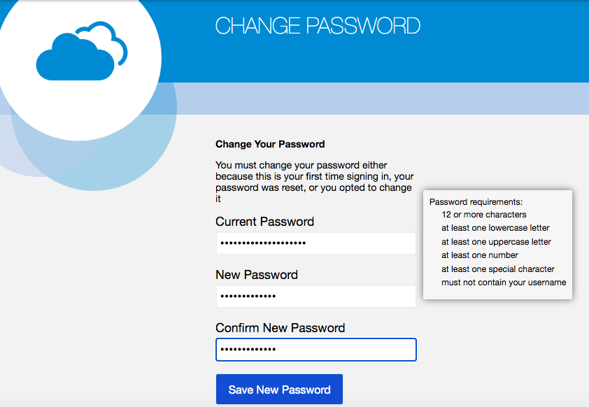

9. Verify user permissions

   a) Go to the **Menu**, click **Compute** and then click **Instances**.

   b) Try to select any compartment from the left menu.

   c) The message “**You don’t have permission to view these resources**” appears. This is normal as you did not add the user to the group where you associated the policy.
      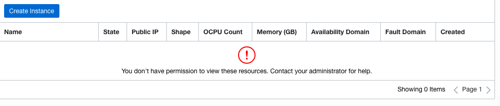

   d) Sign out of the Console.

10. Add User to a Group

      a) Sign back in with the ***admin*** account.
      
      b) On the Menu click Identity, and then click Users. From the **Users** list, click the user account that you just created (for example, `User01`)  to go to the User Details page.
         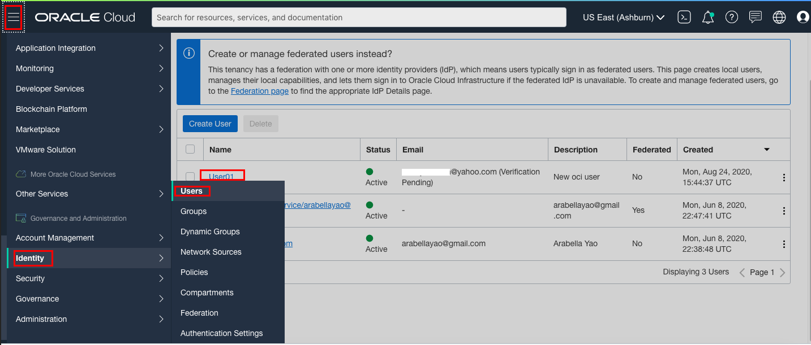
      
      c) Under the **Resources** menu on the left, click **Groups.** if its not already selected.

      d) Click **Add User to Group**.
         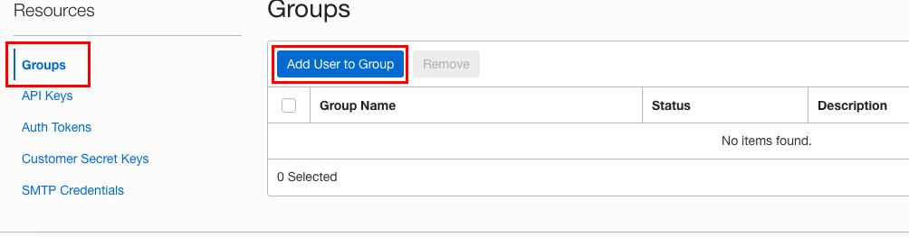

      e) From the **GROUPS** drop-down list, select the **oci-group** that you created.

      f) Click **Add**.
         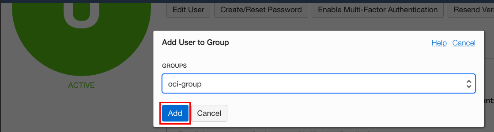

      g) Sign out of the Oracle Cloud website.

11. Verify user permissions when a user belongs to a specific group

      a) Sign in with the local User01 account you created. Remember to use the latest password you assigned to this user.

      b) Go to the **Menu**, click **Compute** and then click **Instances**.

      c) Select compartment **Demo** from the list of compartments on the left.

      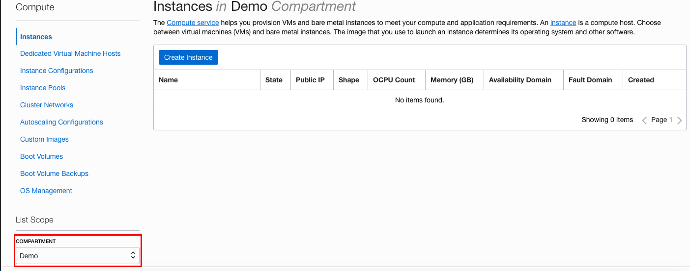

      d) There is no message related to permissions and you are allowed to create new instances

      e) Go to the **Menu**, click **Identity** and select **Groups.**

      f) The message **“Authorization failed or requested resource not found”** appears. This is expected, since your user has no permission to modify groups. (Note: You may instead get the "An unexpected error occurred" message instead. That is also fine.)
         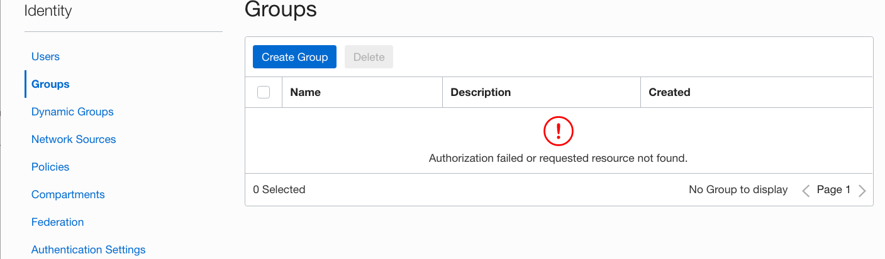

      g) Sign out.

*Congratulations! You have successfully completed the lab.*

## Acknowledgements

- **Author** - Rajeshwari Rai, Prasenjit Sarkar
- **Adapted by** -  Tom McGinn, Database Product Management
- **Contributors** - Arabella Yao, Product Manager Intern, DB Product Management
- **Last Updated By/Date** - Rajeshwari Rai, January 2021

