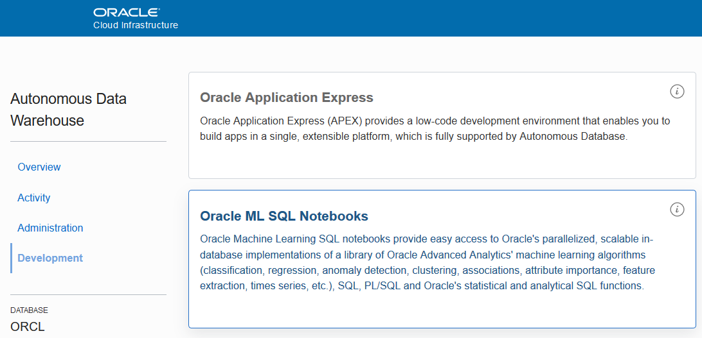

# Using Machine Learning in ADW

## Introduction

Oracle Autonomous Data Warehouse Cloud provides an easy-to-use, fully autonomous database that scales elastically, delivers fast query performance and requires no database administration. In this hands on lab, you will deploy an Autonomous Data Warehouse instance, and load a table using a text file that is stored in object storage. Using the data table, and a Zeppelin Notebook, you will apply Machine Learning algorithms to select a good wine that costs less than $20 to bring to a party.

**Some Key points:**

*We recommend using Chrome or Edge as the broswer. Also set your browser zoom to 80%*

- All screen shots are examples ONLY. Screen shots can be enlarged by Clicking on them

- Login credentials are provided later in the guide (scroll down). Every User MUST keep these credentials handy.

- Do NOT use compartment name and other data from screen shots. Only use  data(including compartment name) provided in the content section of the lab

- Mac OS Users should use ctrl+C / ctrl+V to copy and paste inside the OCI Console

- Login credentials are provided later in the guide (scroll down). Every User MUST keep these credentials handy.

   **Note:** OCI UI is being updated thus some screenshots in the instructions might be different than actual UI.

### Prerequisites

1. [OCI Training](https://cloud.oracle.com/en_US/iaas/training)

2. [Familiarity with OCI console](https://docs.us-phoenix-1.oraclecloud.com/Content/GSG/Concepts/console.htm)

3. [Overview of Networking](https://docs.us-phoenix-1.oraclecloud.com/Content/Network/Concepts/overview.htm)

4. [Familiarity with Compartment](https://docs.us-phoenix-1.oraclecloud.com/Content/GSG/Concepts/concepts.htm)

5. [Connecting to a compute instance](https://docs.us-phoenix-1.oraclecloud.com/Content/Compute/Tasks/accessinginstance.htm)

## **Step 1:** Sign in to OCI Console

* **Tenant Name:** {{Cloud Tenant}}
* **User Name:** {{User Name}}
* **Password:** {{Password}}
* **Compartment:** {{Compartment}}
* **Database Name:** {{Database Name}}
* **Bucket Name:** {{Bucket Name}}

   Sign in using your tenant name, user name and password. Use the login option under **Oracle Cloud Infrastructure**.

    

**Using the Clipboard**

1. To copy content from the lab instructions to your OCI instance, select the content and use Ctrl-C to copy the content.

2. Click on the Clipboard icon and select **Paste to remote session**.

   

3. Click into the pop up window and press Ctrl-V.

4. Click in the tool or field where you want to paste and press Ctrl-V again.

## **Step 2:** Download the Notebook from Object Storage

1. Find the data file in Object Storage. Select **Object Storage** from the menu, then choose **Object Storage** from pull right menu.

   

2. Select your compartment from Scope by expanding root, and then click on the bucket listed in Section 1.

   

3. Select the file <code>Pick_A_Good_Wine_for_Less_Than_20_dollars.json</code> and click the elipses to download the file.

   

6. Note the location where the file was downloaded.

## **Step 3:** Import the Machine Learning Notebook

Next, you will import a Zeppelin Notebook into the Oracle Machine Learning instance associated with your Autonomous Data Warehouse instance.

1. Select Autonomous Data Warehouse from the menu

   

2. Click the instance name listed in Section 1. Be sure to select the correct instance if more than one is listed.

   

3. Click **Service Console**.

   

4. Note: you have to disable the pop-up blocker. Click on the Popup-blocker icon and select **Always allow popups ...**

   

5. Click **Administration** and then click **Manage Oracle ML Users**.

   

6. Click **Show All Users**, then click your OCITEST user

   

7. Enter  in the E-mail Address field, and enter <code>AAbbcc123456</code> in both password fields and click **Save**.

   

8. Your OCITEST user is now added as an Oracle ML User.

   

9. On the previous tab, click **Development** then click **Oracle ML SQL Notebooks**.

   

10. Sign in with your OCITEST user using the password <code>AAbbcc123456</code>.

11. Click on **Notebooks**.
    
    

12. Click **Import** and locate the file <code>Pick_a_Good_Wine_for_less_than_20_dollars.json</code> in the Downloads folder.

13. Select the file and click **Open**.

## **Step 4:** Run the Notebook

1. Click the notebook name to run it.

    

2. Click the gear icon to open Interpreter Binding.

    

3. Select <code>your_database_name</code>_medium and click **Save**.

    

4. Run each paragraph of the notebook by clicking on the run icon.

    

5. Some paragraphs have graphs. If you find the graph is empty or missing, follow the instructions in the comment above the SQL command:

    

6. Experiment with the Keys, Groups and Values to change how you graph the data. For example, click **settings**, and remove COUNTRY and POINTS by clicking the **x** in each tag. Then drag POINTS to Keys, drag PRICE to Groups to see the distribution of price over the wine points ratings.

    

7. Run the remaining paragraphs to choose a wine to bring to your party!

8. When you have completed the Notebook, you can explore other example Notebooks by clicking **Home** from the menu, and then **Examples**.

## **Step 5:** Delete the resources

**Delete Auth Token and Autonomous Data Warehouse**

1. Navigate to User Settings, click **Auth Token** and Click **Delete** for your Auth Token by Hovering your mouse over action icon (Three Dots).

   

2. Navigate to Autonomous Data Warehouse menu, hover over the action icon (three dots) and click **Terminate**.

   

## Acknowledgements
*Congratulations! You have successfully completed the lab.*

- **Author** - Flavio Pereira, Larry Beausoleil
- **Adapted by** -  Yaisah Granillo, Cloud Solution Engineer
- **Last Updated By/Date** - Yaisah Granillo, June 2020

