# Create an Object Storage Service

## Introduction

Oracle Cloud Infrastructure Object Storage service is an internet-scale, high-performance storage platform that offers reliable and cost-efficient data durability. The Object Storage service can store an unlimited amount of unstructured data of any content type, including analytic data and rich content, like images and videos.

With Object Storage, you can safely and securely store or retrieve data directly from the internet or from within the cloud platform. Object Storage offers multiple management interfaces that let you easily manage storage at scale.

Object Storage is a regional service and is not tied to any specific compute instance. You can access data from anywhere inside or outside the context of the Oracle Cloud Infrastructure.

Estimated Lab Time: 15 minutes

**Object storage offers 2 tiers:**

1- Use Standard for data to which you need fast, immediate, and frequent access. Data accessibility and performance justifies a higher price point to store data in the Object Storage

2- Use Archive for data to which you seldom or rarely access, but that must be retained and preserved for long periods of time. The cost efficiency of the Archive Storage tier offsets the long lead time required to access the data

The purpose of this lab is to give you an overview of the Object Service and an example scenario to help you understand how the service works.

### Prerequisites

- Oracle Cloud Infrastructure account credentials (User, Password, Tenant, and Compartment)  

## **STEP 1**: Create Object Storage Bucket

1. From the OCI Services menu, click **Object Storage**.
  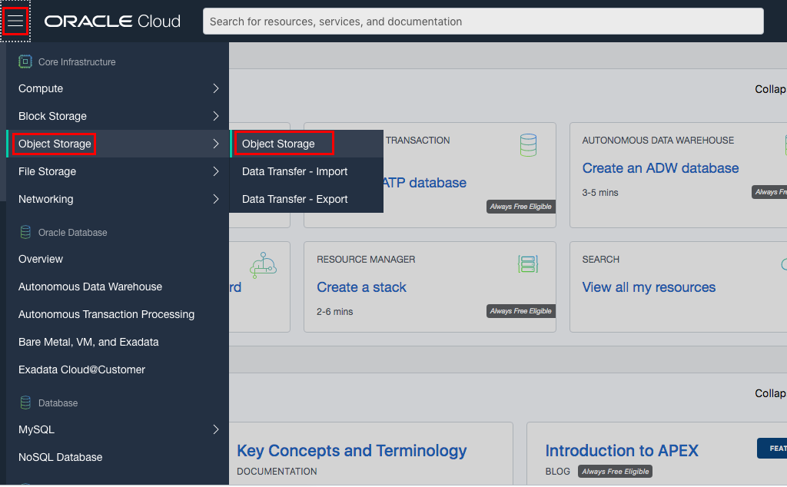

3. Click **Create Bucket**.

  <if type="freetier">
  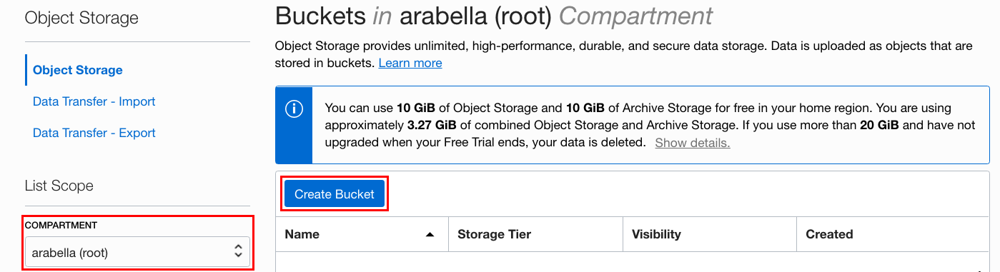</if>
  <if type="livelabs">
  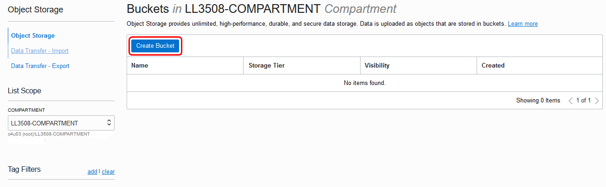</if>
  **NOTE:** Ensure the correct Compartment is selected under COMPARTMENT list

4. Fill out the dialog box:

    - Bucket Name: Provide a name
    - Storage Tier: STANDARD

5.  Click **Create Bucket**

  <if type="freetier">
  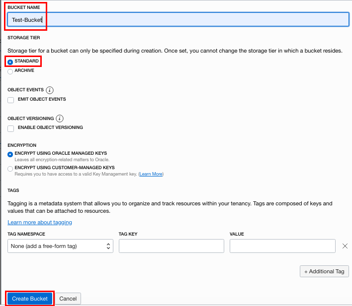</if>
  <if type="livelabs">
  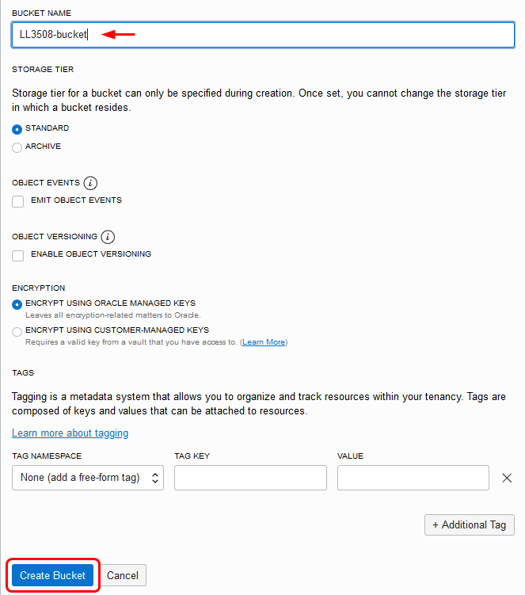</if>

## **STEP 2**: Upload Object and create pre authenticated link

1. Download this file to your local PC: <a href="files/sample-file.txt" download="sample-text" target="_blank">sample-file.txt</a>.

3. Switch to OCI window and click the Bucket Name.

  <if type="freetier">
  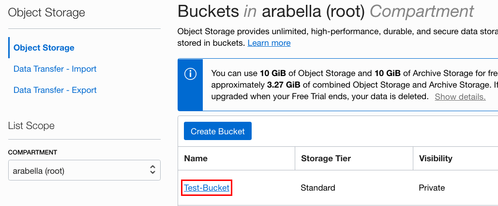</if>
  <if type="livelabs">
  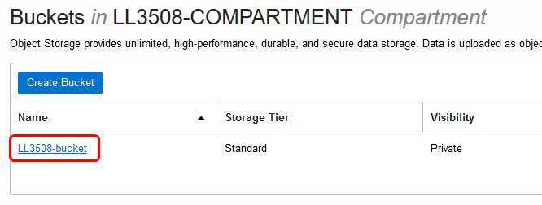</if>

4. Bucket detail window should be visible. Click **Upload**

  <if type="freetier">
  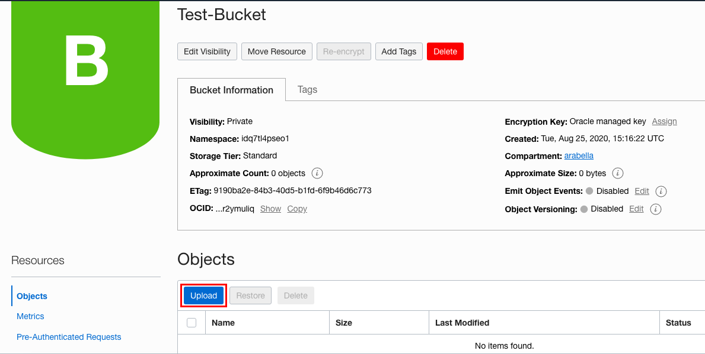</if>
  <if type="livelabs">
  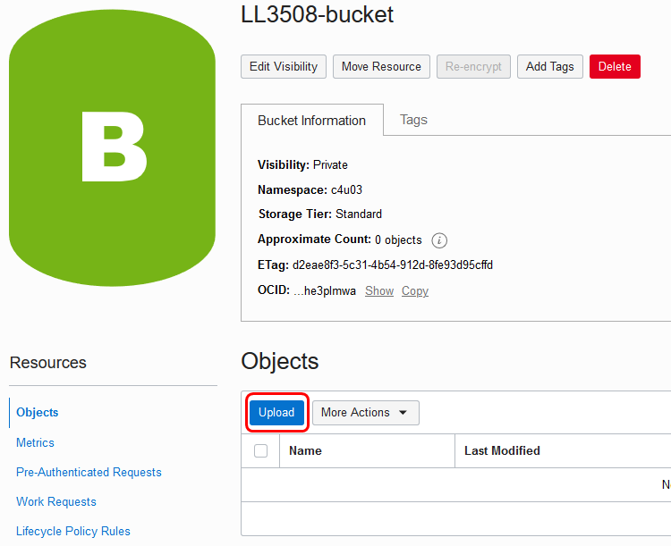</if>

5. Click on *Upload* and then browse to where you created your *sample-file.txt* moments ago.

  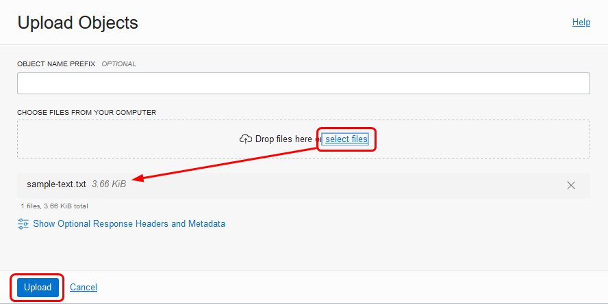

6. Select the file, then click **Upload** in the Dialog box, then click **Close**.

7. File should be visible under Objects. Click Action icon and click **Create Pre-Authenticated Request**. This will create a web link that can be used to access the object without requiring any additional authentication.

  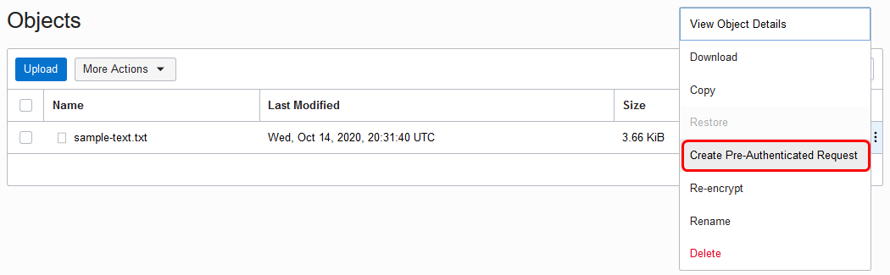

8. Fill out the dialog box:

    - NAME: Use an easy to remember name.
    - PRE AUTHENTICATION REQUEST TARGET: OBJECT
    - ACCESS TYPE: PERMIT READ ON THE OBJECT
    - EXPIRATION DATE/TIME: Specify link expiration date

9. Click **Create Pre-Authenticated Request**

  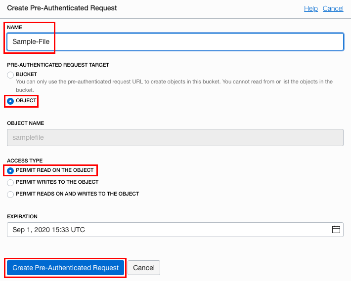

10. Click **Copy** to copy the link

  **NOTE:** The link must be copied and saved once the window is closed the link can not be retrieved again.
  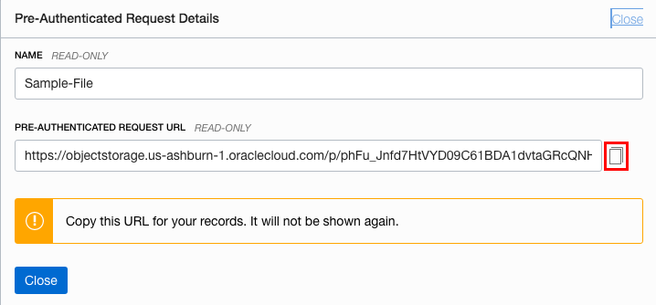

11. Click **Close**

12. Open a new browser window and paste Pre-Authenticated link.
  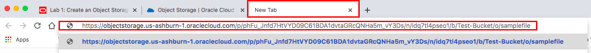

13. As this is a text file, it will open in your browser page.

## Acknowledgements

- **Author** - Flavio Pereira, Larry Beausoleil
- **Adapted by** -  Tom McGinn, Database Product Management
- **Contributors** - Arabella Yao, Product Manager Intern, DB Product Management, Rajeshwari Rai, Prasenjit Sarkar
- **Last Updated By/Date** - Rajeshwari Rai, February 2021

