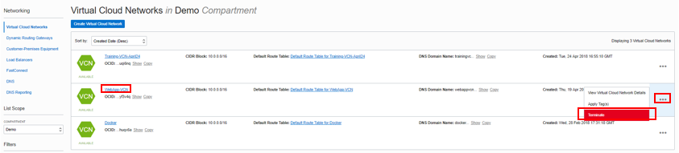

# Configuring Virtual Cloud Network Peering

## Introduction

Local VCN peering is the process of connecting two VCNs in the same region and tenancy so that their resources can communicate using private IP addresses without routing the traffic over the internet or through your on-premises network. Without peering, a given VCN would need an internet gateway and public IP addresses for the instances that need to communicate with another VCN.

## **Step 1:** Sign in to OCI Console and create VCN

**Note:** OCI UI is being updated thus some screenshots in the instructions might be different than actual UI.

1. Sign in using your tenant name, user name and password. Use the login option under **Oracle Cloud Infrastructure**.

    

2. From the OCI Services menu, click **Networking** -> **Virtual Cloud Networks**. Select the compartment assigned to you from drop down menu on left side of the screen and click **Create VCN**.

    **NOTE:** Ensure the correct Compartment is selected under COMPARTMENT list.

3. Fill out the dialog box:

      - **NAME**: Provide a VCN name
      - **COMPARTMENT**: Ensure your compartment is selected
      - **CIDR BLOCK**: Enter 10.0.0.0/16

4. Click **Create VCN**.

5. Virtual Cloud Network will be created and VCN name will appear on OCI Console. Scroll down to find your VCN if multiple VCN exist, and Click your VCN name.

6. In VCN details page, click **Internet Gateways** under Resources, and Click **Create Internet Gateway**. Fill out the dialog box. Click **Create Internet Gateway** (ensure correct compartment is selected).

    

7. Click **Route tables**, and click on **Default Route Table for `<VCN_NAME>`**.

    

8. Click **Add Route Rules**. Fill out the dialog box:

      - **Target Type**: Internet Gateway
      - **Destination CIDR Block**: 0.0.0.0/0
      - **Target Internet Gateway**: Select the Internet Gateway created previously.

9. Click **Add Route Rules**.

10. Click on your VCN and then **Subnets** then **Create Subnet**. Fill out the dialog box:

    - **Name**: Enter a name (for example subnet01).
    - **Subnet Type**: Regional
    - **CIDR Block**: Enter 10.0.0.0/24
    - **Route Table**: Select Default Route Table
    - **Subnet access**: Public Subnet
    - **DHCP Options**: Select Default DHCP Options
    - **Security Lists**: Select Default Security List

11. Leave all other options as default, Click **Create Subnet**.

    

12. Once the Subnet is in the ‘Available’ state, Click **Local Peering Gateways**, then **Create Local Peering Gateway** (local peering gateway  is a component on a VCN for routing traffic to a locally peered VCN). Fill out the dialog box:

    - **NAME**: Provide a name like lpg01
    - **CREATE IN COMPARTMENT**: Select your compartment

13. Click **Create Local Peering Gateway**.

    

14. Create a second VCN using steps above but this time use a non-overlapping CIDR block:

    -**CIDR BLOCK**: 172.16.0.0/16

15. Add Internet Gateway for Second VCN.

16. Add subnet for second VCN, use below data:

    - **Name**: Enter a name (for example Marketing Peering subnet)
    - **Subnet Type**: Regional
    - **CIDR Block**: Enter 172.16.0.0/24
    - **Route Table**: Default Route Table.
    - **Subnet access**: Public Subnet.
    - **DHCP Options**: Select the default.
    - **Security Lists**: Default Security List

17. Leave all other options as default, Click **Create Subnet**.

18. Add route table for second VCN. Click **Route Table**, then **Create Route Table**. Fill out the dialog box:

    - **Name**: Provide a Name
    - **Compartment**: Select your Compartment

    **Click +Additional Route Rules**

    - **Target Type**: Internet Gateway
    - **Destination CIDR Block**: 0.0.0.0/0
    - **Target Internet Gateway**: Select second VCN's internet gateway

19. Leave all other options as default, Click **Create Route Table**.

20. Create second Local peering gateway. Once the Subnet is in the ‘Available’ state, Click **Local Peering Gateways**, then **Create Local Peering Gateway** (local peering gateway  is a component on a VCN for routing traffic to a locally peered VCN). Fill out the dialog box:

    - **NAME**: Provide a Name
    - **CREATE IN COMPARTMENT**: Select your compartment

**We have created two VCN with internet gateway for internet traffic, added default rule in the route table, created subnet and added two local peering gateways(one for each VCN). For VCN peering each VCN must have a local peering gateway.**

## **Step 2:** Create two compute instances and configure routing

1. From OCI services menu, Click **Compute** -> **Instances**.

2. Click **Create Instance**. Fill out the dialog box:

    **This is the first compute instance and ensure to create in the first VCN**.

    - **Name your instance**: Enter a name
    - **Image or operating system**: For the image, we recommend using the Latest Oracle Linux available.
    - **Availability Domain**: Select availability domain
    - **Shape**: Use the default shape selected

    **Under Configure Networking**
    - **Virtual cloud network compartment**: Select your compartment
    - **Virtual cloud network**: Choose the first VCN
    - **Subnet Compartment:** Choose your compartment.
    - **Subnet:** Choose the Public Subnet under **Public Subnets**
    - **Use network security groups to control traffic** : Leave un-checked
    - **Assign a public IP address**: Check this option
    - **Boot Volume:** Leave the default
    - **Add SSH Keys:** Choose 'Paste SSH Keys' and paste the Public Key created under Cloud Shell.

3. Click **Create**.

    **NOTE:** If 'Service limit' error is displayed choose a different shape from VM.Standard2.1, VM.Standard.E2.1, VM.Standard1.1, VM.Standard.B1.1 or choose a different AD.

4. Repeat the steps to create a second compute instance in the **Second VCN**.

    - **Name your instance**: Enter a name
    - **Image or operating system**: For the image, we recommend using the Latest Oracle Linux available.
    - **Availability Domain**: Select availability domain
    - **Shape**: Use the default shape selected

    **Under Configure Networking**
    - **Virtual cloud network compartment**: Select your compartment
    - **Virtual cloud network**: Choose the second VCN
    - **Subnet Compartment:** Choose your compartment.
    - **Subnet:** Choose the Public Subnet under **Public Subnets**
    - **Use network security groups to control traffic** : Leave un-checked
    - **Assign a public IP address**: Check this option
    - **Boot Volume:** Leave the default
    - **Add SSH Keys:** Choose 'Paste SSH Keys' and paste the Public Key created under Cloud Shell.

5. Click **Create**.

6. Once the instances are in running state, note down the public and private IP addresses of the two compute instances.

7. Configure **First local peering gateway**. Click **Local Peering gateway** in your first VCN details page. Hover over the action icon (3 vertical dots) and Click **Establish Peering Connection**.

    

8. Fill out the dialog box:

    - SPECIFY THE LOCAL PEERING GATEWAY: Browse below (To browse the list of available gateways)
    - VIRTUAL CLOUD NETWORK COMPARTMENT: Select your compartment
    - VIRTUAL CLOUD NETWORK: Choose the **second VCN** (Gateway1 needs to pair with Gateway2 that is in second VCN)
    - LOCAL PEERING GATEWAY COMPARTMENT: Choose the compartment
    - UNPEERED PEER GATEWAY: Choose the second peering gateway

    

9. Verify the Local Peering Gateway shows Status as Peered and Peered information is correct.

    

10. We now need to configure Route tables and Security Lists for the two VCNs. Navigate to First VCN's details page and click **Route Tables**, then **Default Route table for `<FIRST_VCN_NAME>`**.

11. Click **Add route rule** and add the following rule

    - Target Type: Select **Local Peering gateway**
    - Destination CIDR Block: Enter 172.16.0.0/24
    - Compartment:  Make sure the correct Compartment is selected:
    - TARGET LOCAL PEERING GATEWAY: Select the Local peering Gateway of First VCN

12. Click **Add Route Rule**.

    

13. Navigate to you VCN details page, Click **Security Lists**, then **Default Security list for <FIRST_VCN_NAME>**. Click **Add Ingress Rule**.

14. Enter the following ingress rule; Ensure to leave STATELESS flag un-checked

    - Source CIDR: 172.16.0.0/24
    - IP Protocol: Select ICMP.
    - Source Port Range: All
    - Destination Port Range: All

    

15. Click **Add Ingress Rule**.

16. Repeat the steps for second VCN Route table and security list. Use below data:

    **Second VCN Route table**

    - Target Type: Select **Local Peering gateway**
    - Destination CIDR Block: Enter 10.0.0.0/24
    - Compartment:  Make sure the correct Compartment is selected:
    - TARGET LOCAL PEERING GATEWAY: Select the Local peering Gateway of second VCN

    **Second VCN Security list rule** (Navigate to Security List and Click **Add Ingress Rule**.)

17. Enter the following ingress rule; Ensure to leave STATELESS flag un-checked.

    - Source CIDR: 10.0.0.0/24
    - IP Protocol: Select ICMP.
    - Source Port Range: All
    - Destination Port Range: All

**We now have two VCNs with one compute instance in each VCN. These VCNs have been connected using a Local Peering Gateway. Any instance in one VCN can reach an instance in the other VCN. Next we will test the connectivity.**

## **Step 3:** ssh to compute instance and test VCN peering

1. Using Cloud Shell, enter the following command:

    ```
    <copy>
    cd ~/.ssh/
    </copy>
    ```

2. Enter **ls** and verify that your ssh file exists.

3. Enter command
    ```
    <copy>
    ssh -i <sshkeyname> opc@PUBLIC_IP_OF_FIRST_COMPUTE
    </copy>
    ```

    **We will ssh to the First compute instance**

    **NOTE:** User name is opc. This will enable port forwarding on local host which is needed to access Grafana dash board later on.

    **HINT:** If 'Permission denied error' is seen, ensure you are using '-i' in the ssh command.

4. Enter 'Yes' when prompted for security message.

5. Verify opc@`<COMPUTE_INSTANCE_NAME>` appears on the prompt.

6. Enter command:

    ```
    <copy>
    ping <PRIVATE_IP_OF_SECOND_COMPUTE_INSTANCE>
    </copy>
    ```

    **NOTE:** Use Private IP of the compute instance that you are not connected to.

    **Verify the ping is successful**

    If ping is successful then we have successfully created VCN peering across two different VCNs.


## **Step 4:** Delete the resources

1. Switch to  OCI console window.

2. If your Compute instance is not displayed, From OCI services menu Click **Instances** under **Compute**.

3. Locate compute instance, Click Action icon and then **Terminate**.

    

4. Make sure Permanently delete the attached Boot Volume is checked, Click Terminate Instance. Wait for instance to fully Terminate

    

5. Repeat the steps to delete the second compute instance.

6. From OCI services menu Click **Virtual Cloud Networks** under Networking, list of all VCNs will appear.

7. Locate your VCN , Click Action icon and then **Terminate**. Click **Delete All** in the Confirmation window. Click **Close** once VCN is deleted.

    

8. Repeat the step to delete the second VCN.


## Acknowledgements
*Congratulations! You have successfully completed the lab.*

- **Author** - Umair Siddiqui, Larry Beausoleil
- **Adapted by** -  Yaisah Granillo, Cloud Solution Engineer
- **Last Updated By/Date** - Yaisah Granillo, June 2020

