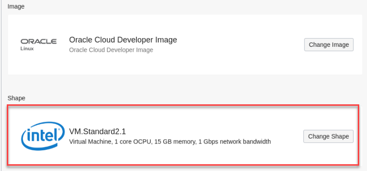
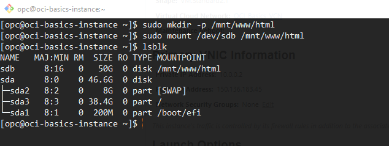
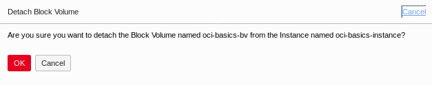
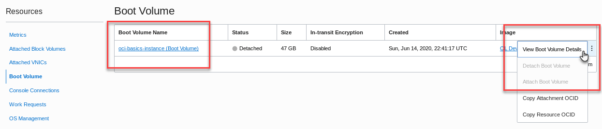

# OCI Basics Lab (VCN, Compute, Boot, Block Volume)

## Introduction

**Description**

The goal of this lab is to demonstrate the basic functionality of OCI and allow the learner to start thinking about creative ways to use cloud infrastructure. In this lab we will show how simple it is to deploy a single instance web application environment in OCI.  The application will need a secured virtual cloud network (VCN), a compute instance, and attached block volume storage.  We'll install and configure open source Apache for our web server.  After the system has been successfully deployed, we'll illustrate how easy it is to re-use the boot and block volumes from the initial instance.  A similar architecture could prove useful with disaster recovery or scaling of compute and storage resources.  

**Lab Objectives**

- Create a virtual cloud network 
- Deploy a Linux based virtual machine in the cloud
- Attach block volume storage to the instance
- Login remotely via secure connection
- Install and configure a simple web-application
- Terminate the instance and transfer the boot and block volumes to another instance

**Lab Overview Video**

- Watch the video below for an accelerated view of the lab steps run through by the author.

<iframe id="kaltura_player" src="https://cdnapisec.kaltura.com/p/2171811/sp/217181100/embedIframeJs/uiconf_id/35965902/partner_id/2171811?iframeembed=true&playerId=kaltura_player&entry_id=1_fi7qamyh&flashvars[streamerType]=auto&amp;flashvars[localizationCode]=en&amp;flashvars[leadWithHTML5]=true&amp;flashvars[sideBarContainer.plugin]=true&amp;flashvars[sideBarContainer.position]=left&amp;flashvars[sideBarContainer.clickToClose]=true&amp;flashvars[chapters.plugin]=true&amp;flashvars[chapters.layout]=vertical&amp;flashvars[chapters.thumbnailRotator]=false&amp;flashvars[streamSelector.plugin]=true&amp;flashvars[EmbedPlayer.SpinnerTarget]=videoHolder&amp;flashvars[dualScreen.plugin]=true&amp;flashvars[hotspots.plugin]=1&amp;flashvars[Kaltura.addCrossoriginToIframe]=true&amp;&wid=1_5ijhw2sx" width="640" height="360" allowfullscreen webkitallowfullscreen mozAllowFullScreen allow="autoplay *; fullscreen *; encrypted-media *" sandbox="allow-forms allow-same-origin allow-scripts allow-top-navigation allow-pointer-lock allow-popups allow-modals allow-orientation-lock allow-popups-to-escape-sandbox allow-presentation allow-top-navigation-by-user-activation" frameborder="0" title="Kaltura Player"></iframe>

[OCI Basics Demonstration Video](https://videohub.oracle.com/media/1_fi7qamyh "OCI Basics Overview")


<!--  old OTube reference (still works but it was suggested we use VideoHub instead)
<iframe id="kmsembed-1_l9g19hat" width="640" height="360" src="https://otube.oracle.com/embed/secure/iframe/entryId/1_l9g19hat/uiConfId/43012852" class="kmsembed" allowfullscreen webkitallowfullscreen mozAllowFullScreen allow="autoplay *; fullscreen *; encrypted-media *" referrerPolicy="no-referrer-when-downgrade" sandbox="allow-forms allow-same-origin allow-scripts allow-top-navigation allow-pointer-lock allow-popups allow-modals allow-orientation-lock allow-popups-to-escape-sandbox allow-presentation allow-top-navigation-by-user-activation" frameborder="0" title="Kaltura Player"></iframe>

[OCI Basics Demonstration Video](https://otube.oracle.com/media/1_l9g19hat "OCI Basics Overview")

-->

**Intended Audience**

- Beginner/Intermediate technical learners
- New to cloud
- New to Oracle Cloud Infrastructure

**Resources**

[vi Editor Cheat Sheet](http://web.mit.edu/merolish/Public/vi-ref.pdf "vi Editor Cheat Sheet")

## Step 1: Create a VCN

1. From the OCI Services menu, choose **Networking > Virtual Cloud Networks**. 


2. Before you can create a VCN, you'll need to be in a compartment where you have authorization to create resources.  From the **List Scope** section, locate the **Compartment** dropdown field and expand the root selection using the plus signs until you find your assigned compartment.   See the image for an example.  Your root compartment and tenancy may be different than the screen shots that follow. Select the compartment that was created for you, the name will begin with the word *luna*.  **Note:** *You will not be able to create any resources in the root, Luna-Labs or ManagedCompartmentForPaaS compartments.* 


3. Click the **Start VCN Wizard** button.  **Note** *Verify that you've chosen the correct compartment.*


4. Select the radio button to create **VCN with Internet Connectivity** and choose the **Start VCN Wizard** button again from the bottom of the pop-up screen.


5. Fill out the configuration form with the following information:  (*The default CIDR blocks should be filled in already.  Accept the defaults for this lab.*)

| **Field**                | **Recommended Information** |
| ------------------------ | ------------------------------------------------ |
|**VCN NAME:** | oci-basics-vcn |
|**COMPARTMENT:** | Ensure your compartment is selected |
|**VCN CIDR BLOCK:** |Provide a CIDR block for the entire network (10.0.0.0/16)|
|**PUBLIC SUBNET CIDR BLOCK:** | Provide a CIDR block for the public facing network (10.0.0.0/24)|
|**PRIVATE SUBNET CIDR BLOCK:** |Provide a CIDR block for the private internal network (10.0.1.0/24)|
|**DNS RESOLUTION:** |Leave "Use DNS Hostnames in this VCN" checked|

- Click **Next**

 

6. Review the information and click the **Create** button.   **Note:** *Don't forget to be in awe of how much networking infrastructure is being created with one or two clicks.  You're creating subnets, gateways, security lists, public access, DNS labels and more, in a matter of a few seconds.  This kind of stuff used to take hours or days.*


7. You have created a virtual cloud network (VCN) with following components:

- **VCN**
- **1 x Public subnet**
- **1 x Private subnet**
- **Internet gateway (IG)**
- **NAT gateway (NAT)**
- **Service gateway (SG)**
- **DNS domain information**
- **Security list and routing information**


8. After the workflow has completed, click **View Virtual Cloud Network** to display your VCN details.


In the next step we will change the VCN security list and open port 80 to the internet.  This will allow http traffic to pass through to the application we're going to deploy on our instance.

9. From the **Resources** section on the left hand side of the VCN screen, choose **Security Lists** and then **Default Security list for <YOUR_VCN_NAME>**


10. Click **Add Ingress Rule** under **Ingress Rules**.
    


11. Use the information from the table to add a stateful ingress rule:

| **Field**                | **Recommended Information** |
| ------------------------ | ------------------------------------------------ |
|**STATELESS** | Leave flag unchecked |
|**SOURCE TYPE:** |CIDR (default)|
|**SOURCE CIDR:** | **0.0.0.0/0**|
|**IP PROTOCOL:** | TCP (Default)|
|**SOURCE PORT RANGE:** | ALL (Default) |
|**DESTINATION PORT RANGE:** |**80** |


12.  Click the **Add Ingress Rules** button at the bottom of the dialog box.  **Note:** *This rule is telling the gateway to allow traffic from any location (0.0.0.0/0) to transport information over port 80 (http) using the TCP protocol stack.  You have now created a security rule to allow http traffic into your VCN.*


In the next step, you will create and configure a compute instance and deploy a simple web application.

## Step 2: Launch Compute Instance

In order for customers to run their business applications, they'll need computing resources.  Oracle provides several different types of compute instances to help customers fulfill their application and performance needs.  Oracle provides bare metal and virtual machine (VM) instance types with different cpu and memory configurations called shapes. In this section you'll learn how to deploy a virtual compute instance with a simple web server application.  This is the basis of cloud computing.

1. From OCI services menu, Click **Compute** then **Instances** to bring up the Create Compute Instance section


2. Click the **Create Instance** button.


There are several sections in the **Create Compute Instance** dialog.   Generally, the sections are Instance Information, including name and compartment.  Placement and hardware, which includes Availability Domain location, Fault Domains, image type and shape. Next is networking where you choose the network configuration that was created earlier.  There's a section for adding SSH keys followed by boot volume options.  And there's an Advanced Options section where you can choose the Fault Domain, add a script to execute on boot, and more.  We will not work with the advanced options in this lab but feel free to explore on your own.

Use the information from the following tables to fill out the Create Compute Instance form:

3.  Enter the compute instance name, select the compartment, and choose an availability domain.

| **Field**                | **Recommended Information** |
| ------------------------ | ------------------------------------------------ |
| **Name** | Enter a name - ex: *oci-basics-instance* | 
| **Create in compartment**| *Select your compartment* |
|**Availability Domain**| AD 1  |


4. In the next step, choose the operating system image to use for your VM instance. Click on the **Change Image** button.  


5. Select the **Oracle Images** tab.  **Note:** There are 5 pages of Oracle Images.  Click on the page arrows until you find the **Oracle Cloud Developer Image**. Select it and click the check box at the bottom to accept the Terms and Restrictions and click the **Select Image** button.


For the compute instance section, review the information provided.  Shape size should default to VM.Standard2.1.  Accept the default.



6. In the **Configure networking** section, you will accept the defaults, but notice the different options.   Choose the button for **Select existing virtual cloud network** and confirm that the VCN you created earlier is listed.   Choose **Select existing subnet** and confirm that public suvnet from your VNC is displayed.  Do not select **Use network security groups** and confirm the radio button is selected for **Assign a public IP address** 

| **Field**                | **Recommended Information** |
| ------------------------ | ------------------------------------------------ |
| **Network** | Select existing virtual cloud network |
| **Virtual cloud network**  | Choose the VCN you created earlier |
| **Subnet** | Select existing subnet
| **Subnet** | Verify that **Public** subnet from your compartment is selected |
| **Use network security groups to control traffic** | Leave unchecked |
| **Assign a public IP address** | Select the radio button |


Next is the **Add SSH Keys** section.  SSH Keys are a requirement for secure connection to the instance you'll be creating.  This section has changed recently to allow you to generate the necessary SSH keys directly from the OCI console.   This process is a little different from generating keys from a client operating system.  Customers can use their own keys, load from the system, or copy and paste their own keys.  For convenience we will use the OCI console.  You'll need to create and paste SSH keys so that you can securely access the new instance.  

7. In the **Add SSH keys** section, select the radio button for **Generate SSH Keys**.  We will allow OCI to generate our key-pair and save a little time. Then click the **Save Private Key** button AND THEN the **Save Public Key** button.   You should see both downloads visible on the bottom of your browser.  They can be located in the Downloads folder of your host system.


8. In the boot volume section, leave the boxes unchecked at their defaults.


9. Click on the **Create** button to create the instance.


The instance will begin provisioning.  You should see the instance details screen with the orange icon indicating it's in provisioning status.   Wait a few moments.  When it's finished, the icon will turn green and enter the *running* state.


10.  Wait for Instance to enter the **Running** state.   Examine the information in the Instance Information screen.   Identify the assigned fault domain, private and public IP addresses, and other important information.  Note that you can control your instance with buttons for **Stop**, **Reboot**, and **Change Shape**.  If you forget how to connect to the instance you can click on *connect to a running instance* for a link to the documentation on how to connect to a cloud instance. 


## Step 3: Connect to the instance

1. In the *Instance Details* screen, locate the field containing the **Public IP Address**.  Click the **Copy** link to copy the IP address to the clipboard.  The link will change briefly to *copied* to indicate success.  Alternately you can right click/drag, then copy the IP address if you wish.  The next step will require the IP address as we connect to the instance.  


2. Open a **Terminal Emulator** from the main desktop applications menu.


3. Using Linux filesystem navigation commands, navigate to the **Downloads** folder. The terminal will likely default to the user home directory, and the Downloads directory should be directly in your path.


SSH keys need to have special permissions in order to be used securely.   We will need to change the permissions on the keys that we downloaded before we can use them.

4. Use the Linux ```chmod``` command to change the permissions to rw for root only.

```
chmod 600 *.key
```

```
chmod 600 *.pub
```
Now you can use the keys securely without errors.


3.5. From the terminal window enter the following SSH command.  Make sure you're in the same directory as the SSH key. The *-i* switch is where you designate the name of the public key (.pub) and following that is the IP address of your compute instance prefaced by the default admin user name, *opc* and the *@* sign.  Answer *yes* to the prompt about accepting the identity and adding to the list of known hosts.

```
ssh -i ssh-key-2020-07-22.key.pub opc@129.213.43.29
```

**Warning!**  You may be asked to provide a passphrase. You did not get the opportunity to provide this passphrase so a simple SSH identity command should take care of that.   If you're asked for a passphrase, use the *ssh-add* command to add the identity to the key.  Type the following command followed by the private keyname:

``` 
ssh-add ssh-key-2020-07-22.key
```

Then try to login again using the ssh command in step 5.

```
ssh -i ssh-key-2020-07-22.key.pub opc@129.213.43.29
```


**Note:**  *The screenshot above shows the passphrase error and overcoming it with the ssh-add command.*

You have successfully created an instance and logged in via SSH.  Feel free to explore the instance environment if you have time to explore.  If you're not familiar with Linux or the command line, there are tons of how-to's and basic Linux tutorials available.  In the next section we'll add external block storage to the instance for application data storage.

## Step 4: Create and mount block storage

OCI offers 3 types of storage that offer different levels of performance, access, and redundancy for customer applications.  **Block storage** is based on physical blocks organized on a physical storage medium, namely SSDs (Solid State Disk), and organized via a file system.  Block storage is accessed via a dedicated storage network commonly referred to as a SAN (Storage Area Network).  Block storage is limited to the physical size of the disk or array of disks, but it is also considered the highest performance option for most applications.  It's ideal for databases and mission critical applications.  **Object Storage** is a data storage architecture that manages data as objects.  Object storage presents massive capacity and the ability to store unstructured data.  Object storage is commonly used for disaster recovery, document storage, and analytics data.   The third type is **File Storage**.  File storage is essentially an OS filesystem that's shared over the network and commonly referred to as NAS (Network Attached Storage).   File storage is a basic Unix function and was commercialized as hardware file storage systems called NAS Appliances. 

You will create block storage for this simple application exercise.

1. From OCI services menu Click **Block Storage** and select **Block Volumes** from the flyout menu.


2. Ensure you're in the correct compartment and click on the **Create Block Volume** button.  Fill out the form with the following information.  

**Note:** *For volume size and performance, the default size is 1024 GB which is equal to roughly 1 terabyte.  The following steps will require a formatted, mounted filesystem so we'll need to decrease this size to 50GB to keep our lab simple and straightforward.   Change the default size to **Custom** and change the size the 50GB.*


| **Field**                | **Recommended Information** |
| ------------------------ | ------------------------------------------------ |
| **Name:**   |  Name of your choice |
| **Create in Compartment:** | Select your compartment |
| **Availability Domain:** | Create in the same AD as the instance|
| **Size:**  | Custom - 50 GB|
| **Compartment for Backup Policies:** |  Select your compartment |
| **Backup Policy:** |  No selection is necessary|
| **Volume Performance:** | Leave as 'Balanced' but note that you can change this if you wish |
| **Encryption:** | Default to Oracle Managed Keys|


3. Click the **Create Block Volume** button. The volume icon will turn orange in color and enter the **Provisioning** state.   In a few moments it will turn green and enter the **Available** state.  It is now ready to use with your instance.

In the next step, we'll attach the block volume to the compute instance.  You can attach a block volume from either the **Instance** section of the console or from the **Block Volume** section of the console.

4. From the Block Volume information screen, click on **Attached Instances** under the **Resources** section.


5. Click the **Attach to Instance** button and use the following information to fill out the resulting dialog box:

| **Field**                | **Recommended Information** |
| ------------------------ | ------------------------------------------------ |
| **Attachment Type:** | Paravirtualized |
| **Access Type:** | READ/WRITE |
| **Select Instance:** | Checked|
| **Choose Instance:** | Choose the instance you created earlier|
| **Device Name:** | Choose the first available path from the drop down. |

**Note:** *Paravirtualized is a faster connection method that could result in slower performance.  iSCSI connection is a more direct path but takes more steps to connect.  For the simplicity of this lab you will use paravirtualization.*


6. Click **Attach**.  After a few moments, you'll get confirmation that your block volume has been attached.  


**Note:** *For this example we've chosen paravirtualized attach because it's fast and simple.  A paravirtualized attachment is a technique where the guest OS utilizes the hypervisor API to access remote storage directly as if it were a local device.  It's fast and simple to mount storage.  There may be a performance hit using paravirtualized block volumes so you may also want to be familiar with mounting storage directly via iSCSI.  See the OCI documentation for instructions on mounting storage to instances via iSCSI.  [Here's a link to a blog explaining the differences.](https://blogs.oracle.com/cloud-infrastructure/paravirtualized-block-volume-attachments-for-vms)*  

You should now have confirmation that the block volume has been attached to the instance.  In the next step, we'll switch back to the SSH session, verify that the block volume is attached, format it, create a filesystem, and mount it to the instance.   

7. Return to the terminal window.  Login to the instance again, if necessary. As the opc user issue the ```lsblk``` command to verify the paravirtualized block volume has mounted and confirm the device path.  In this case, we used the console to choose /dev/sdb and sized it to 50GB so we can verify the device has been mounted.


8.  Format the volume for use by the operating system.  Type the following command into the terminal window.

```
sudo fdisk /dev/sdb -l
```


9. Create a filesystem on the volume using the ext4 filesystem and naming the volume 'data'.   We are using the entire disk so enter *Y* at the prompt for a single partition.   Type the following command:

```
sudo mkfs.ext4 -L data /dev/sdb
```


4.10.  Create a mount point. mount the block volume, and verify that it's mounted to the system.    Type the following three commands.

```
sudo mkdir -p /mnt/www/html
```

```
sudo mount /dev/sdb /mnt/www/html
```

```
lsblk
```



You have successfully formatted and mounted the external block volume.   Next you will install and configure a simple web application.

## Step 5: Install and configure a web application

 In the following section we'll install the Apache web server and configure it for use with our simple application.
 
1.  Install the httpd server, enter the following command in a terminal window connected to your OCI cloud instance:

```
sudo yum install httpd -y
```


In an earlier step, we added a security rule to allow traffic from the internet to port 80 through our virtual cloud network.You also need to configure the standard Linux firewall to allow traffic on the instance itself.

2. Open port 80 on the instance firewall to allow http traffic.  

```
sudo firewall-cmd --permanent --add-port=80/tcp
```

```
sudo firewall-cmd --reload
```


Start up the web service and install a simple html application.

3. Start the httpd service.  Enter the following command in the terminal.   (Note: There's no output for this command.)

```
sudo systemctl start httpd
```

4. Download a pre-built application and install it.    Run the following command from the *opc* users home directory.

```
wget https://github.com/snafuz/oci-quickstart-lab/archive/master.zip
```


5. Unzip the file into the *opc* users home directory.   And copy the web application structure into the web servers document root.

```
unzip master.zip
```

```
sudo cp -R oci-quickstart-lab-master/static/* /mnt/www/html/
```


6. Next you will need to modify the server configuration file (httpd.conf) with the application location.    Use *vi* or your favorite Linux text editor and modify the web server configuration file, ```/etc/httpd/conf/httpd.conf```. You will be editing this file to change the default location where web application files are stored, from */var/www/html* which would be located on the system drive, to */mnt/www/html* which is located on the block volume that we created for our server.
 
**Note:**  *A good idea would be to make a copy of the configuration file with a .bak extension in case you make any mistakes or accidentally corrupt the file.*

**Note:** Launch *vi*, from the a terminal window.  *vi* is a standard text editor and available in every version of the Unix and Linux operating system.  *vi* can be a bit awkward for some so if you're not familiar with it, do a search the web for a *vi cheat sheet* or use the one in the resources section of the Luna lab.  There are many available text editors in Linux.   You can use *gedit*, or whatever Unix/Linux editor you maybe be familiar with.  You can use *nano*, *vim*, *emacs* from the terminal, or *gedit*, which is  available on the Luna desktop or in the startup menu.  The examples below will illustrate using vi.

```
sudo vi /etc/httpd/conf/httpd.conf
```

7. Search for the string */var/www* and replace it with */mnt/www*. You'll make three replacements and one is a comment, you don't need to edit the comment if you don't want to.  There are three references to the **cgi-bin** directory.  You don't need to change those.


Be sure to save your changes.   (Hint:  In *vi* its ```:wq!```)

8. Change the security context of the application subdirectory. And then restart the httpd server.   Enter the following commands:

```
sudo chcon -R --type=httpd_sys_rw_content_t /mnt
```

```
sudo systemctl restart httpd
```


9. In the browser window, navigate back to the compute instance details for your instance.  Locate and copy the IP address.


10. In the browser, open a new window or tab.  In the uri locator field, enter "http:// and your compute instance's public IP in the URI field.

```
http://<COMPUTE_INSTANCE_PUBLIC_IP>
```

You should see the simple http application form in your browser.  


**Congratulations!**  Your application is up and running on OCI!

So far you have created a cloud network, launched an instance, created and attached block storage, configured a web server, and created a simple application.   In the next section you will delete the first compute instance.  Then you'll launch a new compute instance with the boot and block volume that you created for the first instance, thus retaining the configuration information from the first instance.

## Step 6: Re-use the boot and block volumes for a new instance.

In this section we're going to detach the block volume and terminate the instance.  You will then use the existing boot volume to launch a new compute instance. And you'll re-attach the block storage.  This type of action can be helpful for customers with disaster recovery or building 'golden images' which helps with resource re-use and streamlining of operations in the cloud.

1. SSH to the instance and un-mount the block volume.  Enter the following command, adding the device path from your instance.

```
sudo umount /dev/<VOLUME_NAME>
```


2. Open the OCI console window, navigate to the compute instances page and click on the instance you created. Click on the **Attached Block Volumes(1)** in the Resources section. Click the ellipsis to the right and select **Detach** from the brief menu.


3. You will receive a warning about detaching iSCSI targets.   This is an important warning but we've already un-mounted the volume.  Click **Continue Detachment**.


4. And to reinforce the fact that dismounting a live data volume could result in errors and lost data, Click **OK** on the "Are you sure you want to detach this volume" message.



Wait for the block volume to completely detach.


5. From the instance information screen, stop the compute instance by clicking the **Stop** button.   


Read the warning message and click **Stop Instance** to confirm your choice. 


6. The instance will begin shutting down, the icon will turn orange and display **Stopping**.  Shutdown will take a few moments.  Once it enters the **Stopped** state, select **Boot Volume** from the Resources section, click on the ellipsis (action menu) and select **Detach**.  Click **OK** to confirm your selection.


7. Click **Detach Boot Volume** to confirm the detachment.


In a few moments, the boot volume will report that it's been detached.  Next you will terminate the compute instance.  

8. From the **More Actions** drop down menu at the top of the **Instance Details** page, click **Terminate** to terminate the instance.


**Note** In the confirmation dialog box, **DO NOT** check the box for *"Permanently delete the attached Boot Volume"*.


9. Once the instance is terminated, scroll down to the Boot Volume section showing the *detached* boot volume and click the boot volume link to view boot volume details.  You can also use the action menu ellipsis on the far right and choose **View Boot Volume Details**.



10. In the Boot Volume Details window click the **Create Instance** button towards the top. 


11. Use the following information to create a new compute instance:  
 
**Note** *The information will be largely the same from your prior instance but you won't have to choose an operating system image as it's already installed on the boot image. You also won't have to specify SSH keys because they're already installed on the instance boot volume.*

| **Field**                | **Recommended Information** |
| ------------------------ | ------------------------------------------------ |
|**Name your instance:** |oci-basics-instance-02 |
|**Choose an operating system or image source:** |Defaults to **Boot Volume**|
|**Availability Domain:**| Select availability domain |
|**Instance Shape:**| VM.Standard2.1|
|**Virtual cloud network compartment:**| Select your compartment |
|**Virtual cloud network:**| Choose VCN created earlier|
|**Subnet Compartment:** |Choose your compartment. 
|**Subnet:** |Choose the **Public** Subnet |
|**Use network security groups to control traffic:**|Leave un-checked |
|**Assign a public IP address:** |Check this option |
|**Add SSH Keys:** |No SSH Keys|


12. Click **Create**.

13. Once the instance is in the Running state, use the **Attached Block Volumes** dialog in the Resources section to attach the block volume to this new instance.  In the dialog, select **Paravirtualized** for volume attachment type.  Select the block volume you created earlier **oci-basics-bv** from the drop down menu.   Choose **oraclevdb** from the device path drop down and click **Attach**. 


14.   Wait for the block volume to fully attach.


15. Once the volume has finished attaching, open a terminal window and SSH to the compute instance using the new IP address.  Mount the block volume using the steps you followed earlier in the lab.

16.  Locate the IP address of the instance from the instance details screen.   You will have a new IP as it's a different instance.


17. Open a terminal window and SSH to the instance.  Type *Yes* to confirm the fingerprint.

```
ssh -i <your SSH key-name> opc@<your ip address>
```


18. Enter the following commands to mount the block volume and restart the web server:

```
lsblk
```

```
sudo mount  /dev/sdb  /mnt/www/html
```

```
sudo systemctl restart httpd
```


19.  Use the web browser and open a new window or tab.  Enter **http://<your compute instance's public IP address>** in the URI locator.  The IP address below is just for example.

**http://150.136.226.104**


You should see the simple form for the web application that you created earlier.    You have successfully re-used the boot and block volume that were attached to another instance with all the data preserved.   This simple example could be used to change compute shapes, create a re-usable golden image, or any solution where a portable instance might come in handy.  

**Congratulations!** You have completed the OCI Basics lab.   You have created a cloud compute instance and a cloud network.  You've attached block storage, installed a simple http application, and migrated boot and block storage to a new instance.  