# Creating Compute Instance using Custom Image

## Introduction

In this lab we will use Custom image feature of OCI. Using this feature an existing Compute instance with software packages and updates installed can be used to created additional compute instance.  These new compute instances will come with all the software packages and updates pre-installed.

## **STEP 1**: Sign in to OCI Console and create VCN

1. Sign in using your tenant name, user name and password. Use the login option under **Oracle Cloud Infrastructure**.
    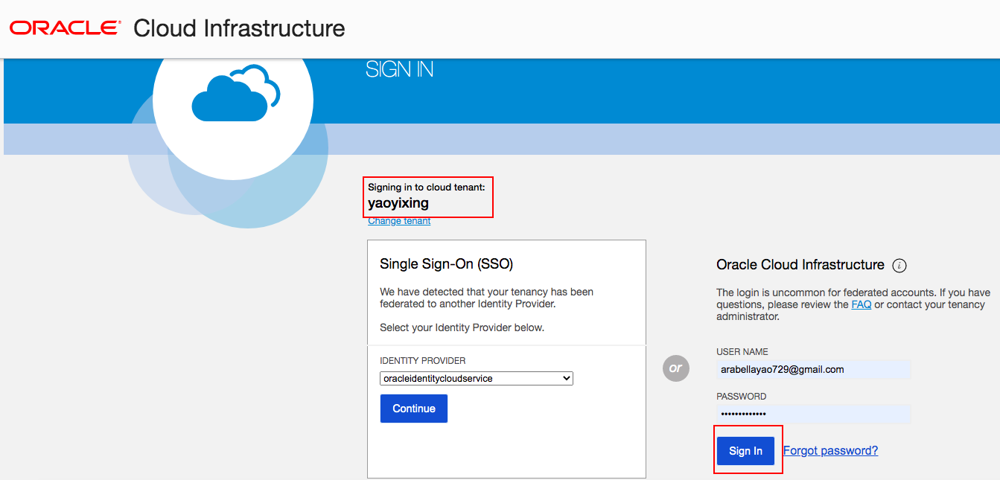

2. From the OCI Services menu, Click **Virtual Cloud Networks** under Networking. Select the compartment assigned to you from the drop down menu on the left part of the screen under Networking and Click **Start VCN Wizard**.

    **NOTE:** Ensure the correct Compartment is selected under COMPARTMENT list.

3. Click **VCN with Internet Connectivity** and click **Start VCN Wizard**.

4. Fill out the dialog box:

      - **VCN NAME**: Provide a name
      - **COMPARTMENT**: Ensure your compartment is selected
      - **VCN CIDR BLOCK**: Provide a CIDR block (10.0.0.0/16)
      - **PUBLIC SUBNET CIDR BLOCK**: Provide a CIDR block (10.0.1.0/24)
      - **PRIVATE SUBNET CIDR BLOCK**: Provide a CIDR block (10.0.2.0/24)
      - Click **Next**

    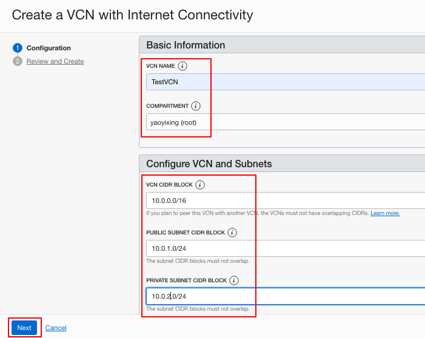

5. Verify all the information and  Click **Create**.

6. This will create a VCN with the following components.

    *VCN, Public subnet, Private subnet, Internet gateway (IG), NAT gateway (NAT), Service gateway (SG)*

7. Click **View Virtual Cloud Network** to display your VCN details.

## **STEP 2**: Create a compute instance

1. Go to the OCI console. From OCI services menu, under **Compute**, click **Instances**.

2. Click **Create Instance**. Fill out the dialog box:

      - **Name your instance**: Enter a name
      - **Create in Compartment**: Choose the same compartment you used to create the VCN
      - **Choose an operating system or image source**: For the image, we recommend using the Latest Oracle Linux available.

3. Click **Show Shape, Network and Storage Options**:

      - **Availability Domain**: Select an availability domain (the default AD 1 is fine)
      - **Shape**: Click Change Shape

      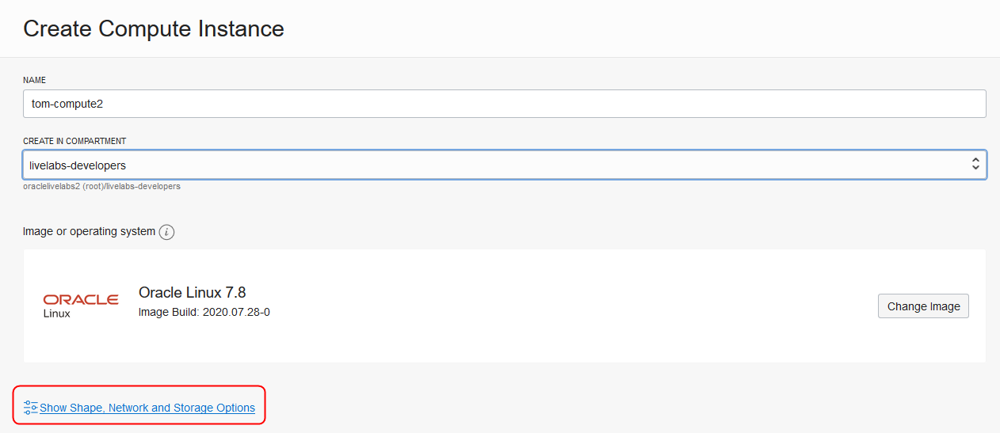

4. In the **Browse All Shapes** dialog:

      - **Instance Type**: Select Virtual Machine
      - **Shape Series**: Intel Lake
      - **Instance Shape**: Select VM.Standard2.1

      Click **Select Shape**.

      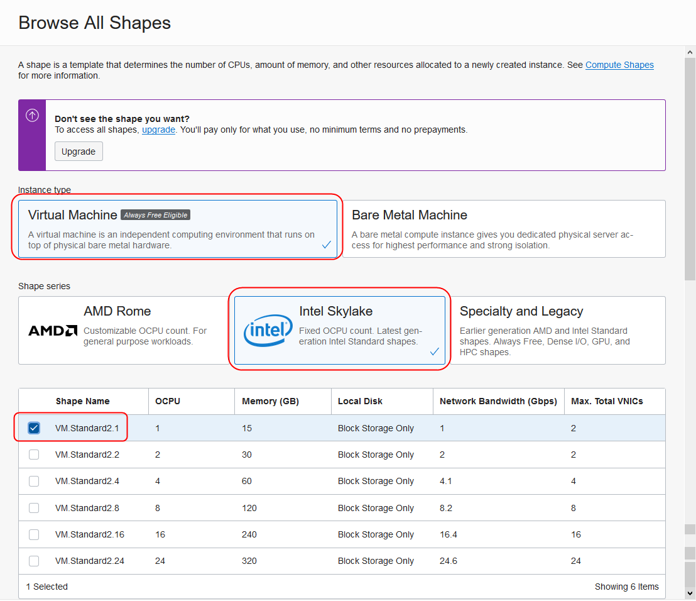

5. Under Configure Networking:

      - **Virtual cloud network compartment**: Select your compartment
      - **Virtual cloud network**: Choose the VCN you created in Step 1
      - **Subnet Compartment:** Choose your compartment
      - **Subnet:** Choose the Public Subnet under **Public Subnets**
      - **Use network security groups to control traffic** : Leave un-checked
      - **Assign a public IP address**: Check this option

      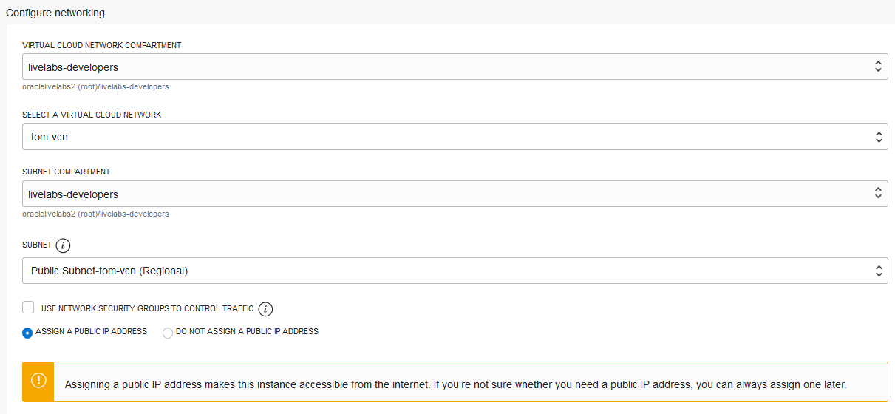

6. Boot Volume and Add SSH Keys     

      - **Boot Volume:** Leave the default, uncheck values
      - **Add SSH Keys:** Choose 'Paste SSH Keys' and paste the Public Key saved in Lab 1

      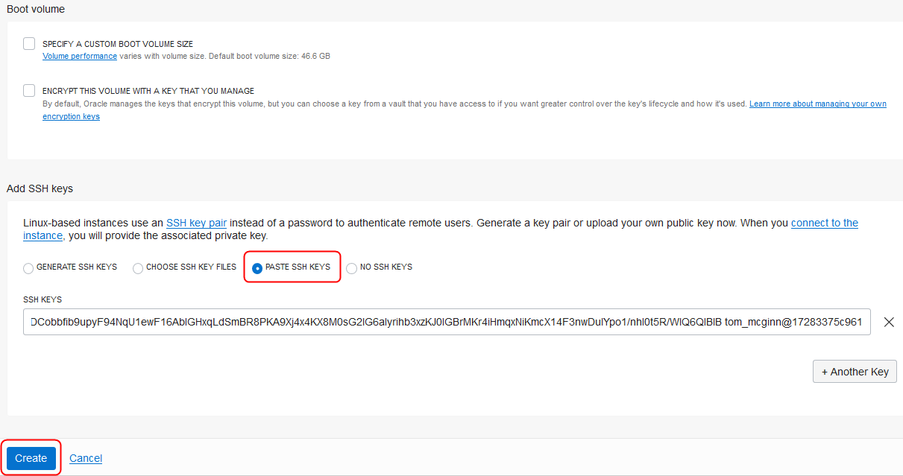

7. Click **Create**.

   **NOTE:** If 'Service limit' error is displayed choose a different shape from VM.Standard2.1, VM.Standard.E2.1, VM.Standard1.1, VM.Standard.B1.1  OR choose a different AD

8.  Wait for Instance to be in **Running** state. In Cloud Shell Terminal, enter:

    ```
    <copy>cd ~/.ssh</copy>
    ```
9.  Enter **ls** and verify your SSH key file exists.

10.  SSH into your compute instance:
    ```
    <copy>ssh -i <sshkeyname> opc@<PUBLIC_IP_OF_COMPUTE></copy>
    ```

    **HINT:** If 'Permission denied error' is seen, ensure you are using '-i' in the ssh command. You MUST type the command, do NOT copy and paste ssh command.

11.  Enter 'yes' when prompted for security message, and enter your passphrase.

     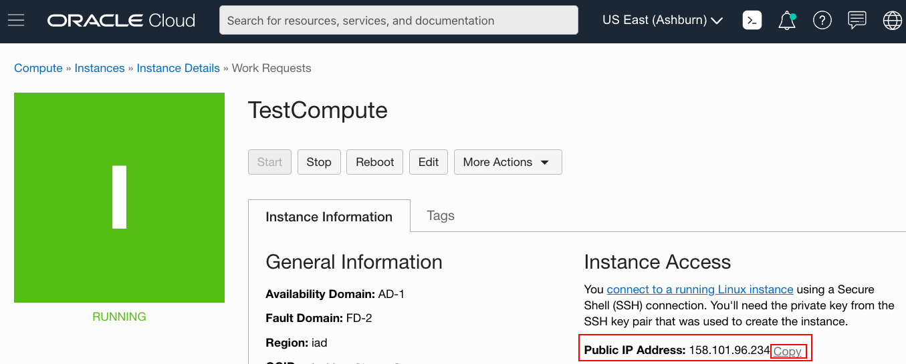
     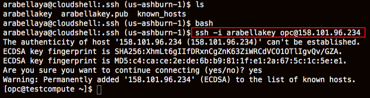

12.  Verify opc@`<COMPUTE_INSTANCE_NAME>` appears on the prompt.

## **STEP 3**: Install httpd on compute instance and create custom image

1. Switch to ssh session to compute install. Install httpd server, Enter Command:
    ```
    <copy>
    sudo yum -y install httpd
    </copy>
    ```

2. Start httpd, Enter command:
    ```
    <copy>
    sudo systemctl start httpd
    </copy>
    ```

3. Verify http status, Enter command:
    ```
    <copy>
    sudo service httpd status
    </copy>
    ```

4. We now have installed httpd server on a compute instance and will create a custom image. Switch back to OCI Console window.

5. From OCI services menu, Click **Instances** under **Compute**.

6. Click your compute instance name and Click **Stop**, and **Stop Instance** in the dialog.
     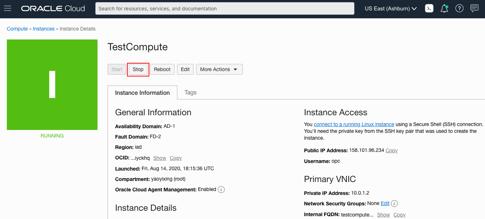

7. Once Stopped, Click **Create Custom Image** from **More Actions** menu
     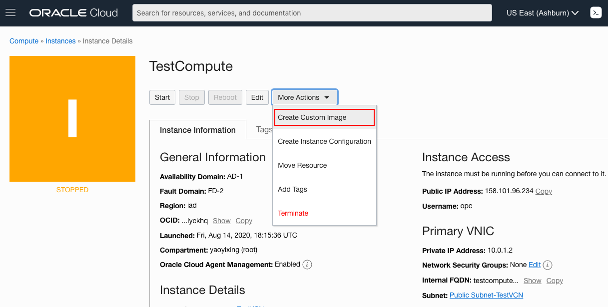

8. Fill out the dialog box and Click **Create Custom Image**. VMs status will change to **Creating Image**.
     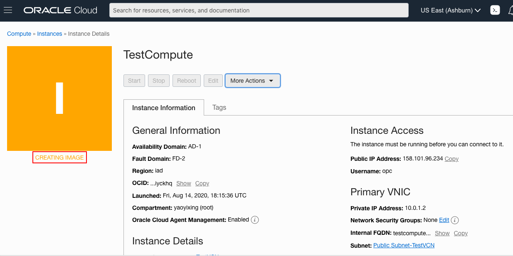

## **STEP 4**: Start a custom image

1.  Navigate to main Instances page under compute and Click **Custom Images**. Locate your custom image, Click the Action icon and then **Create Instance**.
     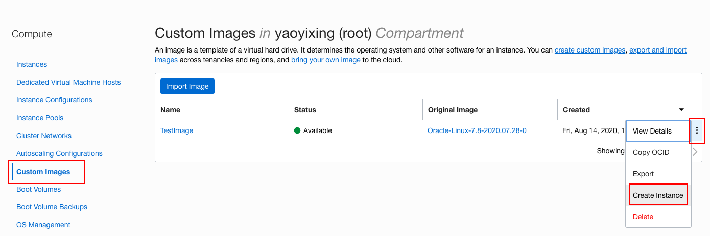

2. Fill out the dialog box and Click **Create**. Once the instance is in running state note down it's Public IP address.

3. SSH to the compute instance as we did in Step 2.

     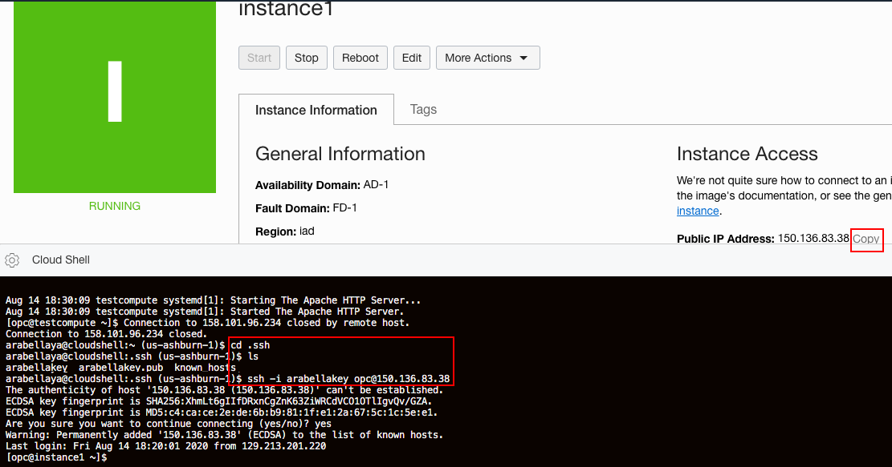

4. Start the httpd service in the custom image:

    ```
    <copy>
    sudo service httpd start
    </copy>
    ```

5. Check the status of httpd service as before.

    You have successfully created a custom image with httpd already installed and used this custom image to launch a compute instance and started httpd service. In this new compute instance there was no need to re-install httpd server as it was already present when the custom image was created.

    A compute instance can have a lot more applications installed and this custom image feature facilitates launching new compute instances with these applications pre-installed.

## **STEP 5**: Delete the resources

1. Switch to  OCI console window.

2. If your Compute instance is not displayed, From OCI services menu Click **Instances** under **Compute**.

3. Locate first compute instance, Click Action icon and then **Terminate**.
     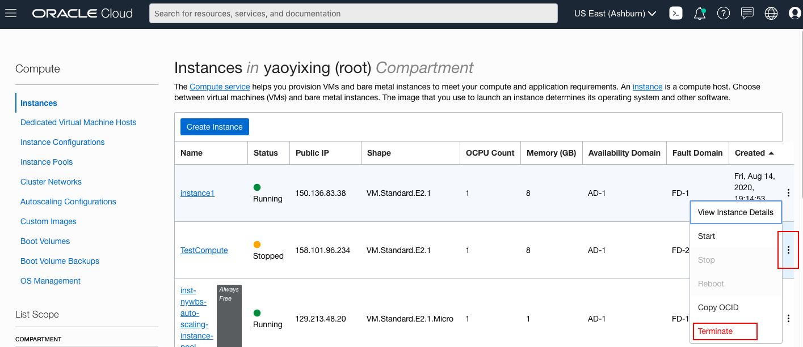

4. Make sure Permanently delete the attached Boot Volume is checked, Click **Terminate Instance**. Wait for instance to fully Terminate.
     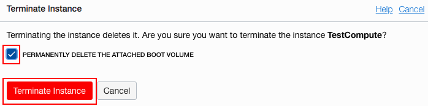

5. Repeat the step to delete second compute instance.

6. From OCI Services Menu Click **Compute** then **Custom Images**. Locate the custom image you created. Click the Action icon and then **Delete**.

7. From OCI services menu Click **Virtual Cloud Networks** under Networking, list of all VCNs will appear.

8. Click on your VCN , then click **Terminate**.

     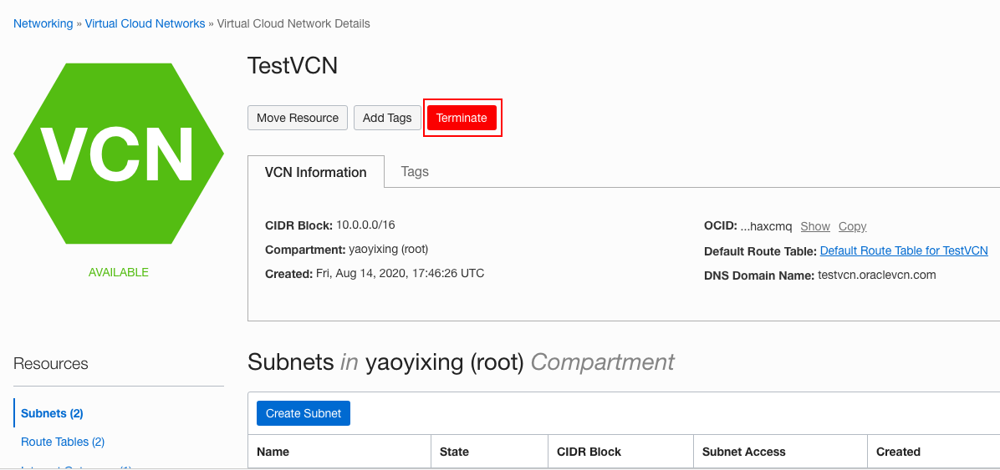

   Click **Terminate All** in the Confirmation window. Click **Close** once VCN is deleted.


## Acknowledgements
*Congratulations! You have successfully completed the lab.*

- **Author** - Flavio Pereira, Larry Beausoleil
- **Adapted by** -  Yaisah Granillo, Cloud Solution Engineer
- **Contributors** - Arabella Yao, Product Manager Intern, DB Product Management, Kamryn Vinson, Intern
- **Last Updated By/Date** - Tom McGinn, August 2020

