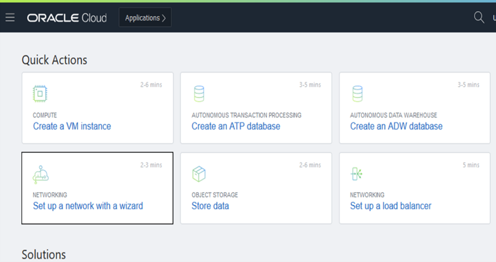

# Virtual Cloud Networks

## Introduction

Oracle Cloud Infrastructure Compute lets you create multiple Virtual Cloud Networks (VCNs). These VCNs will contain the security lists, compute instances, load balancers and many other types of network assets.

Be sure to review [Overview of Networking](https://docs.cloud.oracle.com/iaas/Content/Network/Concepts/overview.htm) to gain a full understanding of the network components and their relationships, or take a look at this video:

### Prerequisites

To sign in to the Console, you need the following:

- Tenant, User name and Password
- URL for the Console: [https://cloud.oracle.com/](https://cloud.oracle.com/)

## **STEP 1**: Create Your VCN (Virtual Cloud Network)

<if type="livelabs">
You are running this workshop in a LiveLabs environment. Our LiveLabs environments use a pre-configured Virtual Cloud Network (VCN), so you will not create a VCN in this workshop. However, you can see how a VCN is created  in Oracle Cloud Infrastructure by watching this short video:

 
 </if>

<if type="freetier">
To create a VCN on Oracle Cloud Infrastructure:

1. On the Oracle Cloud Infrastructure Console Home page, under the Quick Actions header, click on Set up a network with a wizard.

    

2. Select **VCN with Internet Connectivity**, and then click **Start VCN Wizard**.

    

3. Complete the following fields:

    |                  **Field**              |    **Value**  |
    |----------------------------------------|:------------:|
    |VCN NAME |OCI\_HOL\_VCN|
    |COMPARTMENT |  Choose the ***Demo*** compartment you created in the ***Identity and Access Management Lab***
    |VCN CIDR BLOCK|10.0.0.0/16|
    |PUBLIC SUNBET CIDR BLOCK|10.0.2.0/24|
    |PRIVATE SUBNET CIDR BLOCK|10.0.1.0/24
    |USE DNS HOSTNAMES IN THIS VCN| Checked|

    Your screen should look similar to the following:

    

4. Click the **Next** button at the bottom of the screen.

5. Review your settings to be sure they are correct.
    

6. Click the **Create** button to create the VCN. It will take a moment to create the VCN and a progress screen will keep you apprised of the workflow.

    

7. Once you see that the creation is complete (see previous screenshot), click on the **View Virtual Cloud Network** button.
</if>

### Summary

This VCN will contain all of the other assets that you will create during this set of labs. In real-world situations, you would create multiple VCNs based on their need for access (which ports to open) and who can access them. Both of these concepts are covered in the next lab ***Create a Compute Service***.

## Acknowledgements

- **Author** - Rajeshwari Rai, Prasenjit Sarkar
- **Adapted by** -  Tom McGinn, Database Product Management
- **Contributors** - Oracle LiveLabs QA Team (Kamryn Vinson, QA Intern, Arabella Yao, Product Manager Intern, DB Product Management)
- **Last Updated By/Date** - Rajeshwari Rai, January 2021

